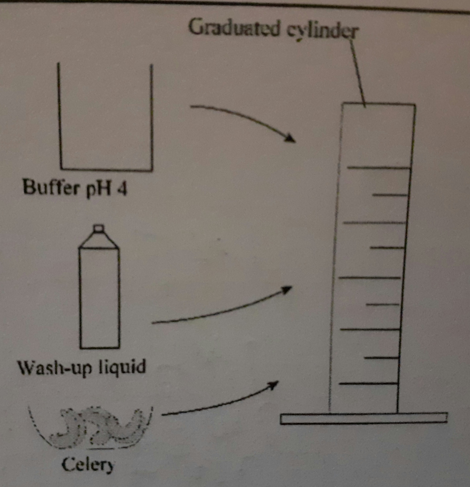

# Title: Investigate the effect of temperature on the rate of enzyme activity

## Materials/Equipment/Apparatus
- Celery
- Scalpel
- Weigh boat
- Electric balance
- Cutting board
- Buffer pH solution
- Washing up liquid
- Graduated cylinder
- Beaker
- Boiling Tubes
- Water bath
- Thermometer
- Water
- Hydrogen Peroxide

## Procedure/Method
1. Chop the celery into fine pieces using the scalpel. Weigh 5g and get 5g of chopped celery
2. Add 20ml of the buffer pH solution, a drop of washing up liquid and the 5g of celery into your graduated cylinder
3. Put 2ml of hydrogen peroxide into a boiling tube
4. Set up your water bath to be at your desired temperature and place the graduated cylinder and the boiling tube into the water bath and wait 2 minutes
5. Pour the hydrogen peroxide into the graduated cylinder and record the volume of the graduated cylinder
6. Wait 2 minutes and record the final volume of the graduated cylinder

## Safety/Risks
- Hydrogen Peroxide can cause burns and is corrosive
- Tie back hair
- Wear googles
- Wear gloves
- Only handle the Hydrogen Peroxide only when you need to

## Labelled Diagram

## Results

|Temperature (°C)|Initial Volume (cm³)|Final Volume (cm³)|Volume of Foam (cm³)|
|----------------|--------------------|------------------|--------------------|
|Ice Water       |22ml                |28ml              |6ml                 |
|20°C              |21ml                |22ml              |1ml                 |
|30°C              |21ml                |39ml              |18ml                |
|50°C              |28ml                |30ml              |2ml                 |
|60°C              |43ml                |58ml              |15ml                |

## Conclusion

We have found out that enzyme activity is different depending on the temperature level and that enzyme activity is highest when there is a temperature of 30 degrees with 18ml of foam and lowest when there is a temperature of 20 degrees with 1ml of foam.

## Graph
