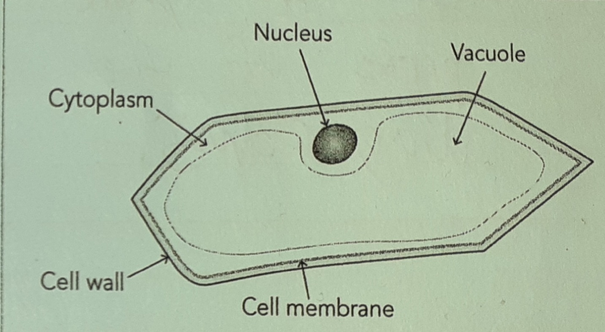
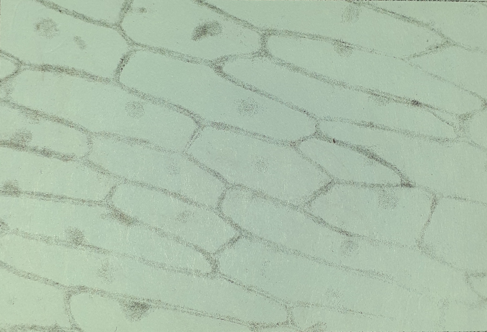

# Title: To Prepare and examine plant (onion) cells, unstained and stained, using the light microscope

## Materials/Equipment/Apparatus

- Microscope
- Microscope slides
- Cover slips
- Mounted needle
- Forceps
- Petri dish
- Onion
- Chopping board
- Sharp Knife
- Small paintbrush
- Droppers
- Water
- Iodine stain
- Absorbent paper

## Procedure/Method

1. Set up microscope
2. Place a drop of water on a slide
3. Cut the onion in half and locate some epidermal tissue
4. Peel off the epidermis with forceps
5. Cut it into small pieces
6. Put these pieces into water in a Petri dish
7. Transfer one piece into the drop of water on the slide using the small paintbrush
8. Place a cover slip at the edge of the water at an angle 45º to the slide
9. Slowly lower the cover slip onto the water, supporting it with a mounted needle to avoid trapping air bubbles
10. Dry the slide with absorbent paper
11. Examine under the microscope
12. Repeat the above steps using iodine stain instead of water
13. Draw labelled diagrams at low power (x40) and at high power (x400)

## Labelled Diagrams

## Conclusion

We were able to prepare, see and identify the cells and parts of the cell in the onion

[Cell Pictures]()