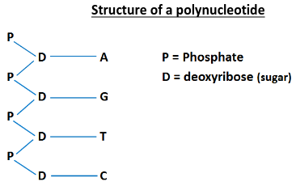
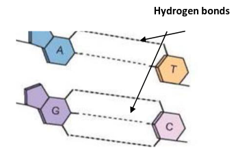
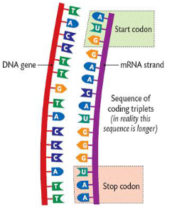
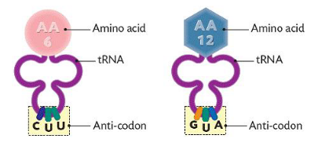
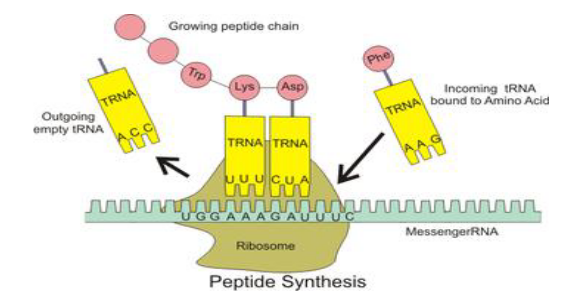
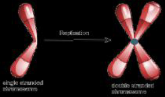
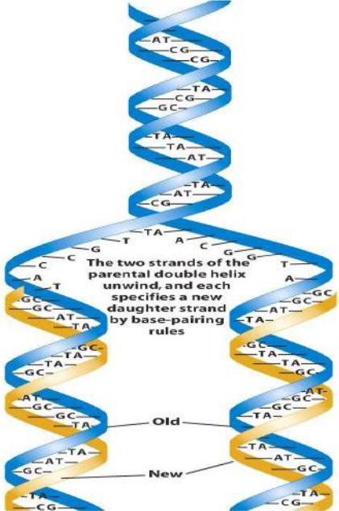

# DNA and RNA

## Structure of DNA

DNA = **d**eoxribo**n**ucleic **a**cid

- DNA is located inside the nucleus of a cell.
- DNA can fit into a nucleus as it can coil and fold.
- DNA has two strands.

**NOTE:** DNA is also found in the **mitochondria** and **chloroplast** of cells

<!--card-->

There are four bases used in DNA:

- **A** = adenine
- **T** = thymine
- **G** = guanine
- **C** = cytosine

<!--card-->

What is meant by the term **complimentary base pairs?**

- These are **bases that match** (correspond) with each other.
- Adenine joins with thymine
  - A -> T
- Guanine joins with Cytosine
  - G -> C
- **A**pples (adenine) in the **t**rees (thymine), **C**ar (cytosine) in the **g**arage (guanine)

<!--card-->

What shapes does DNA have?

- DNA has a **double helix shape**

<!--card-->

What is a gene?

- A gene is a **section of DNA** that has the code for the production of protein

<!--card-->
 
## The Genetic Code

- **What is the genetic code?** It is a **sequences of three bases** (codon or triplet) that represents a code for an amino acid
- **How many common amino acids are used in the production of proteins?** 20
- A gene carries different codes to control the formation of the different amino acids.
- Examples:
  - A DNA triplet **CAA** is the code for the amino acid called **valine**
  - A DNA triplet **CGA** is the triplet for an amino acid called **alanine**

<!--card-->

What is non-coding DNA?

- They **do not have a code** for the formation of a protein
- Non-coding DNA is also known as **junk DNA**.

<!--card-->

What is the structure of a nucleotide?

- DNA is made up of units called nucleotides

<!--card-->

<!--card-->

Sugar is Deoxyribose = D

Phosphate group = P

Nitrogen base = A or G or T or C

<!--card-->

What is a polynucleotide?

- It is many nucleotides joined together

<!--card-->

What holds base together?

- Bases are held together by a **hydrogen bond**
- Adenine and thymine form **two** weak hydrogen bonds.
- Guanine and cytosine form **three** hydrogen bonds.

<!--card-->

What are purines and pyrimidines?

- There are four nitrogen bases, two are known as **purines** and two as **pyrimidines**.
- Two **purine** bases are (double ringed molecules): adenine (A) and guanine (G)
- Two p**y**rimidine bases are (single ringed molecules): th**y**mine (T) and c**y**tosine (C)

<!--card-->

What scientists discovered the shape and structure of DNA?

- Frances **Crick** and James **Watson**

<!--card-->

## Structure of RNA

**RNA** = **r**ibo**n**ucleic **a**cid

- RNA also consist of four bases
- RNA contains the base **uracil instead of thymine**
- The bases in RNA pair up with those in a section of DNA
- RNA is a single stranded molecule

<!--card-->

What are the four bases of RNA:

1. Adenine (A)
2. **Uracil (U)**
3. Guanine (G)
4. Cytosine (C)

<!--card-->

## Base pairing between DNA and RNA

**Example:** If DNA has sequence **GCAATC** along one strand, then the RNA will have the sequence **CGUUAG**

<!--card-->

## Differences between DNA and RNA

| DNA | RNA |
|-|-|
| Has the bases ATGC | Has the bases AUGC |
| Double stranded | Single stranded |
| Sugar = deoxyribose | Sugar = ribose |
| Found in the nucleus | Found in nucleus, cytoplasm, ribosome |

**NOTE**: DNA is also found in the mitochondria and the chloroplast (this is known as **non-nuclear DNA**)

<!--card-->

## Protein Synthesis (the making of protein)

- Genes are used to produce different proteins. A gene is a **section of DNA** that has the code for the production of protein
- The major steps involved in protein synthesis include:
  1. **Transcription** = making of mRNA from DNA (occurs in **nucleus**)
  2. **Translation** = making of protein depending on the mRNA code (occurs in the **ribosome**)

<!--card-->

Three types of RNA involved in production of protein:

1. Messenger RNA (mRNA) 
2. Transfer RNA (tRNA)
3. Ribosomal RNA (rRNA)
- Remember: all produced in the <u>nucleus!</u>

Steps involved in transcription:

- 1: Enzymes start to unwind the DNA double helix in the nucleus
- 2: Complimentary RNA bases join to the exposed DNA strand to form mRNA **(transcription)**
- 3: The enzyme **RNA polymerase** joins the RNA bases together to **form mRNA** (messenger RNA)

<!--card-->

NOTE: **Each mRNA strand has:**

1. A **start** codon
2. A series of codons represent different amino acids
3. A **stop** codon

**NOTE**: start codon and stop codon are not involved in protein production

<!--card-->

Steps involved in translation:

- 4: mRNA moves from the nucleus to the cytoplasm
- 5: rRNA (ribosomal RNA) are found in the ribosome
- 6: **mRNA** then moves into the ribosome and forms a **weak bond** with the **rRNA** (rRNA holds the mRNA in place in ribosome)
  - **NOTE:** ribosome is the site for protein synthesis
- 7: **tRNA** (transfer RNA) is found in the cytoplasm
  - tRNA contains an **anticodon attached to an amino acid**
  - 
  - **NOTE:** an anticodon is a sequence of three bases on tRNA
- 8: tRNA is attracted to the mRNA in the ribosome. The anticodon on the **<u>tRNA compliments</u> the codon on <u>the mRNA</u>**
- 9: As the tRNA attach to the mRNA in the ribosome, it also brings with it an **amino acid**

_ 10: As the tRNA continue to enter the ribosome, the **amino acids detach from the tRNA** and bond together to form a new protein
- 11: RNA leave the ribosome without any amino acids and pull with it the mRNA strand out of the ribosome
- 12: The process stops once it has reached the stop codon. A new protein has been produced and **becomes functional when it folds**

<!--card-->

### Review

Functions of RNA:

- **mRNA (messenger RNA)** – gets code from the DNA in nucleus/ then carries this code to the ribosome
- **rRNA (ribosomal RNA)** – binds (or holds) the mRNA in place in the ribosome
- **tRNA (transfer RNA)** – carries an amino acid to the ribosome/ it binds with the mRNA/ places amino acid in sequence
- **NOTE:** If a DNA sequence in a gene is not correct, the amino acids that join together will not form the correct protein (e.g cystic fibrosis)

<!--card-->

## DNA Replication

- When **mitosis** occurs, one cell divides into two identical daughter cells
- DNA replication occurs so there is an **exact copy of the DNA** for mitosis to occur
- Takes place during the **interphase** of a cell

<!--card-->

How does DNA replication occur?

- Enzyme breaks the hydrogen bond between the base pairs. The double helix **unwinds**
- Other DNA bases now enter the nucleus and join with the exposed DNA strand
- **Two new strands of DNA** are formed that are identical to the original strand

<!--card-->

## DNA Profiling

What is DNA Profiling?

- It is a method of making a **unique pattern of bands** from the DNA of a person which is then used to tell the difference of that DNA from other DNA

<!--card-->

### Method of DNA profiling

1. **DNA is released:**
  - DNA is released by the breaking down of the cell
2. **DNA is cut into fragments:**
  - _

## Important Definitions

| Terms | Definitions |
|-|-|
| Triplet (codon) | A sequence of three bases |
| Genetic code | <u>A sequence of three bases</u> (codon or triplet) that represents a code for an amino acid |
| Gene | <u>A section of DNA</u> that has the code for the production of protein |
| Complementary bases | Complementary bases are when each base has a different corresponding base (or bases that match each other) |
| Nucleotide | A nucleotide consists of a phosphate group , deoxyribose (sugar) and a nitrogen base |
| Polynucleotide | A polynecleotide are many nucleotides joined together |
| Anti codon | A sequence of three bases on the tRNA that complement three bases on the mRNA |
| DNA profiling | DNA profiling makes a pattern of DNA bands of a person, which can be used to distinguish that DNA from other DNA |
| Restriction enzymes | Restriction enzymes are used to cut the DNA into different fragments |
| Genetic screening | The testing of DNA for an altered gene | 
| Protein synthesis | The making of a protein |
| Translation | The making of a protein using the mRNA code |
| Transcription | The making of mRNA from DNA |
| Purines | Double ringed molecules e.g. adenine and guanine |
| Pyrimidines | Single ringed molecules e.g. cytosine and thymine |
| Non coding DNA | They **don't have a code** for the formation of a protein. Non-coding DNA is also known as **junk DNA** |
