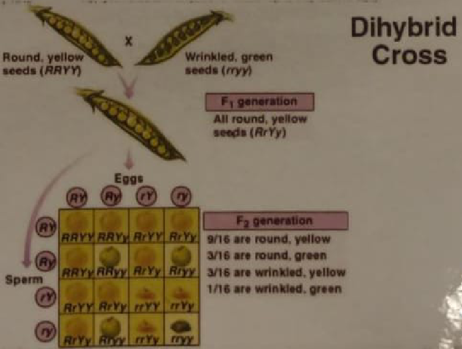
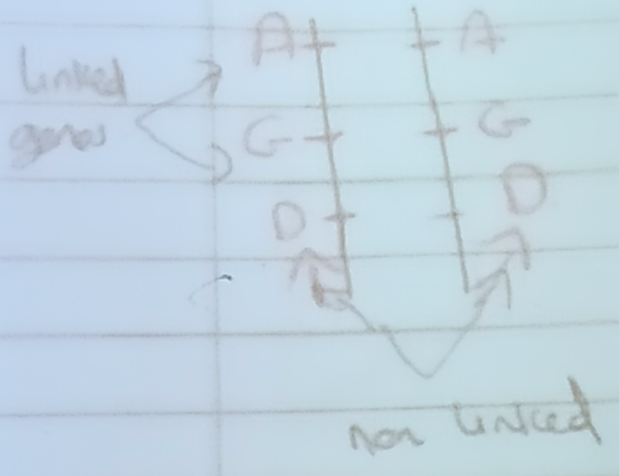

# Genetic Inheritance

## Definitions

- Heredity - The passing of features from one generation to the next
- Genetics - The study of **heredity**
- Fertilisation - <u>The fusion of male and female gametes to form a diploid zygote</u>
- Gametes - <u>Haploid cells capable of fusion</u>

## Terms

| Terms | Definition |
|-|-|
| Monohybrid | One trait |
| Bihybrid | Two traits |
| Homozygous | Same form (two identical alleles) |
| Heterozygous | Different (two different alleles) |

## Sex Chromosomes

- We have 46 chromosomes, or 23 pairs
- <u>Autosomes</u> are <u>non sex chromosomes</u> - We have <u>44</u> Autosomes (no. 1 - 22)
- The other <u>2</u> chromosomes are the <u>sex chromosomes</u>: the <u>X chromosome</u> and the <u>Y chromosome</u>
- Males have XY
- Female have XX
- All embryos start life as female

## Alleles

- Alternative forms of **<u>genes</u>**
- Units that determine heritable traits
- HAIR COLOUR is the GENE
- BLOND, BLACK, RED are all ALLELES
- CHIN is the GENE
- SQUARE and ROUND are the ALLELES

## Genetic Terms

- Alternative forms of **<u>genes</u>**
- **Dominant alleles (TT - tall pea plants)**
- **<u>Dominant (uppercase letter) - allele that is always expressed if present</u>**
- **Recessive (lowercase letter) alleles (tt - dwarf pea plants)**
- **<u>Recessive - the allele that is prevented from being expressed by dominant allele</u>**

## Phenotype

- Outward appearance
- <u>Physical</u> characteristics
- Examples:
1. Tall pea plant
2. Dwarf pea plant
3. Brown eyes

**Genotype** = Genetic make up of an organism

- TT (homozygous dominant)
- tt (homozygous recessive)
- Tt (heterozygous)

**Non-nucleur DNA** = DNA which is found in mitochondria and chloroplast which can also be inherited via the egg ovum

Most DNA is found in chromosomes in the nucleus

(Only the head of the sperm fuses with the egg so if we get DNA from mitochondria it comes from the egg)

## Punnett Square

- A punnett square is used to show the possible combinations of gametes
- T = tall pea plant
- t = dwarf plant
- Phenotype of parent = Tall pea plant x Dwarf pea plant
- Genotype of parent = TT x tt
- Genotype of gamete = 
- Genotype of progeny (first generation of progeny) = Tt
- Phenotype of F. = Tall plants (all)
- Mendel's first law of segregation: Genes separate during gamete formation
- Gametes fuse together
- F1 generation together 
- Genotype of F2 progeny = TT Tt Tt tt
- Phenotype of F2 progeny = 3 Tall, 1 dwarf

### Incomplete dominance (codominance)

_

---

Linked Genes = Genes that are located on the same chromosomes and are therefore inherited together

- DiHybrid Cross = cross involving two characteristics at a time
- Example: Dwarf White Pea Plant x Tall Red Pea Plant 
  - T = tall
  - t = dwarf
  - R = red
  - r = white
  - Genotype of Dwarf White Pea Plant = ttrr
  - Genotype of Tall Red Pea Plant = TtRr or TTRR or TTRr or TtRR

---

## Mendel's 1st Law of Segregation

Only one member of a pair of alleles enters a gamete

## Mendel's 2nd Law of Independent Assortment

Either member of a pair of alleles has an equal chance of entering a gamete with either member pf any other pair of factors

## DiHybrid Cross Example with Pea Plants

- Parent Phenotype: Dwarf White x Tall Red
- Parent Genotype: ttrr x Tr Rr
- Gametes: tr x TR Tr tR tr

**Cross:**

| | TR | Tr | tR | tr |
|-|-|-|-|-|
| tr (This is crossing with the gametes on top) | TtRr | Ttrr | ttRr | ttrr |

- Genotype of F1: TtRr, Ttrr, ttRr, ttrr
- Phenotype of F1: Tall Red, Tall White, Short Red, Short White
- Ratio: 1 (25%) : 1 (25%) : 1 (25%) : 1 (25%)

## Linked Gene Example

- Linked Genes = Genes that are located on the same chromosome + inherited together
- Genes that are linked don't obey the law of independent assortment (2nd law - Mendels)
- Fruit flies = Drosophilia Melanogarter
  - Often used in genetic crosses

**Example:**

- Long Wings (L) **OR** Vestigial (Short) Wings (l)
- Wide abdomen (W) **OR** Narrow abdomen (w)
