# Photosynthesis

Plants making their own food

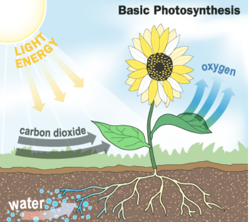

<!--card-->

## Role of Photosynthesis

- Plants use it to make food
- Animals get their food from plants
- It produces oxygen which is needed in respiration to release energy
- It is responsible for forming fossil fuels
- It removes carbon dioxide from the air

<!--card--> 

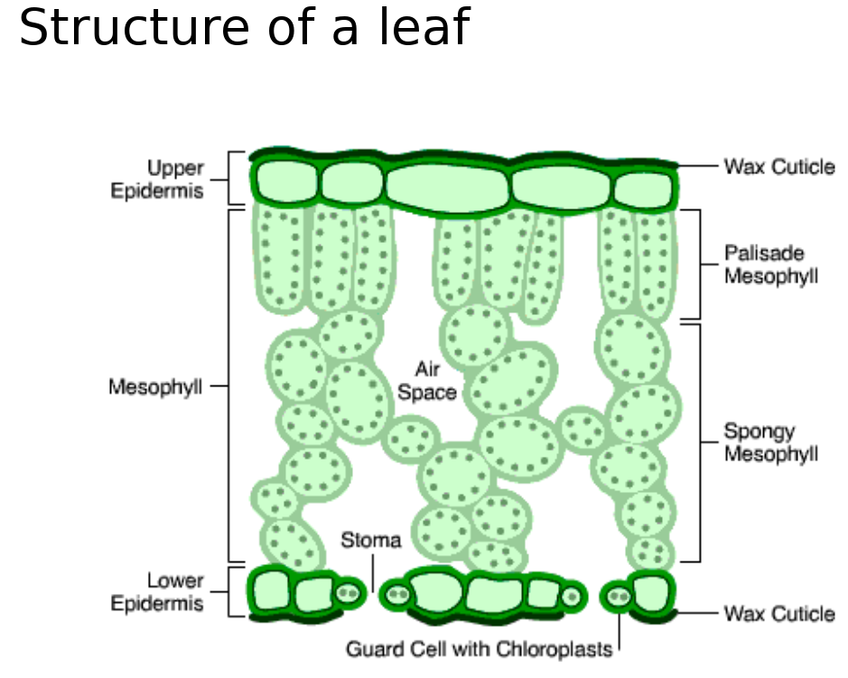

Stoma is singular. Stomata is plural.

<!--card--> 

## Adaptations of a leaf to its role in photosynthesis

- Large and flat *
- Thin *
- Chloroplasts located close to upper epidermis
- Stomata
- Airspaces
- Veins *

<!--card--> 

## Balanced Equation for Photosynthesis

Chemical Equation: 6CO2+6H2O+light -> C6H12O6+6O2

Word Equation: Carbon Dioxide + Water + Light -> Glucose + Oxygen

- CO2 = Carbon Dioxide
- H2O = Water
- C6H12O6 = Glucose
- O2 = Oxygen

<!--card--> 

## Ultra structure of the Chloroplast

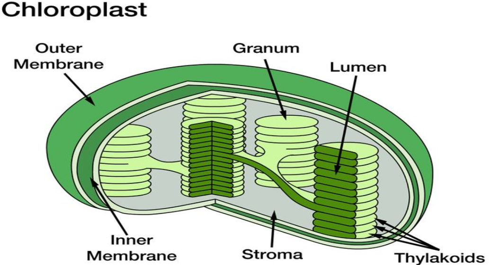

- The thylakoids contain the chlorophyll which traps the sun's energy
- Single sheet of thylakoid = Lamella
- Stacks of lamella = Granum

<!--card--> 

## Photosynthesis requires

- Carbon dioxide
- Water
- Light energy
- Chlorophyll

<!--card--> 

## Photosynthesis produces

- Glucose
- Waste Oxygen

<!--card--> 

## Photosynthesis converts

Light energy -> chemical energy

<!--card--> 

## Stages in Photosynthesis

- Light is absorbed
- Water is split
- Products are produced (4 protons, 4 electrons and oxygen)
- Light energises electrons
- Glucose is formed

<!--card--> 

## Light is absorbed

- The **light** that reaches a plant is **trapped by chlorophyll**
- **Chlorophyll** is found in the **chloroplasts** of plant cells
- Therefore **photosynthesis occurs in chloroplasts**
- The trapped light provides the energy the plants need to make glucose

<!--card--> 

## Water is split

- Some of the trapped light energy is used to split water into oxygen gas (O2) protons (H+) and electrons (e-)
- **Summarised as 2H2O -> 4H+ and 4e- and O2**

<!--card--> 

## What happens to these Products?

1. The electrons are passed to chlorophyll
2. The protons are stored in a proton pool for later use
3. The oxygen may pass out of the leaf into the atmosphere or else may be used for plant respiration

<!--card-->

## Light Energises Electrons

- The electrons that were passed to the chlorophyll become energised by some of the trapped light energy - this changes them into high energy electrons

<u>Glucose is formed</u>

- The high energy electrons along with protons from the proton pool are combined with carbon dioxide to form glucose (C6H12O6)

<!--card-->

## Sources of light for plants

- Sunlight is the natural source of light for plants but they can use artificial light for photosynthesis
- **<u>Artificial light</u> is often used in greenhouse stimulate growth**
- Increasing the **light** can increase growth up to a certain **saturation point** where no more light can be absorbed and photosynthesis will level off

<!--card-->

## Sources of carbon dioxide for plants

- Plants have 2 sources of carbon dioxide one is external the other is internal
- Plants get most of their carbon dioxide from the atmosphere this is external
- Plants get carbon dioxide internally from their own cellular respiration
- **Sometimes artificial sources of carbon dioxide are used to stimulate growth** e.g. burning gas in a green house

<!--card-->

## Sources of water for plants

- Water is absorbed from the soil by the roots of plants
- This water passes up the stem and is used for photosynthesis

<!--card-->

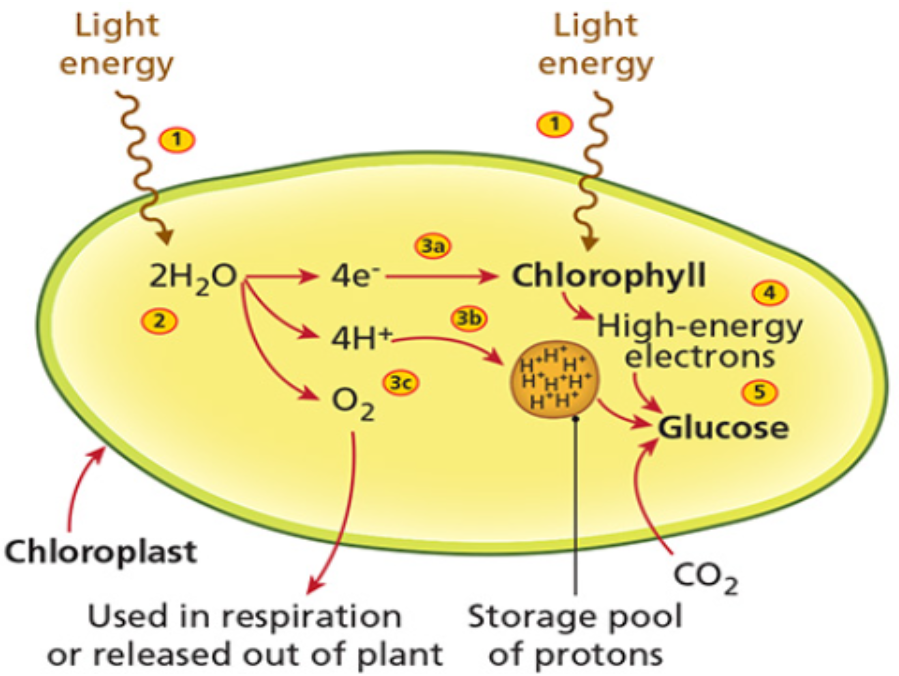

<!--card-->

## General Summary

In the chloroplast, the energy from the light is absorbed.

1. Some light energy is used to release high-energy electrons from chlorophyll
2. Some light energy is used to split water into H+ ions (protons), electrons and oxygen
  - The H+ ions go into a common pool of protons in the chloroplast
  - The electrons from water go to the chlorophyll to replace those lost
  - Most of the oxygen gas is released as a waste product out of the leaf through the stomata
  - Some of the oxygen produced will be used in the cells of the leaf for respiration

Carbon dioxide is then combined with the protons and the high-energy electrons and produces glucose

1. The carbon dioxide
  - Enter the lead through the stomata, found mainly on the underside of the leaf
  - Some carbon dioxide used in photosynthesis comes from respiration within the plant itself
2. The light for photosynthesis comes from the sun in the natural environment
3. The water for photosynthesis comes up to the leaf from the roots via the **xylem** vessels in the veins

<!--card-->

## Photosynthesis Extended Study (Higher Level Only for The Rest of This Page)

### Objectives

- Explain the role of ATP
- Explain the production if ATP from ADP
- Explain the role of NADP+ in trapping & transferring electrons & H ions
- Explain the Light Stage (Light Dependent)/Dark Stage (Light Independent)
- State the two-pathway system of electron carriage
1. Direct to chlorophyll
2. Trapped by NADP+

<!--card-->

### 2 Stages of Photosynthesis

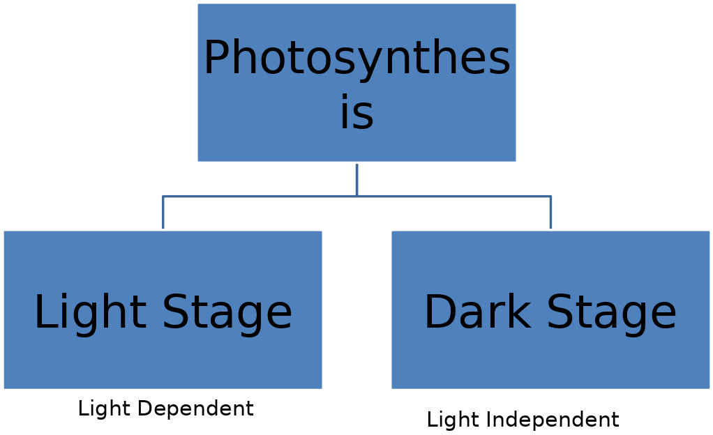

<!--card-->

#### Light Stage (Light Dependent) 

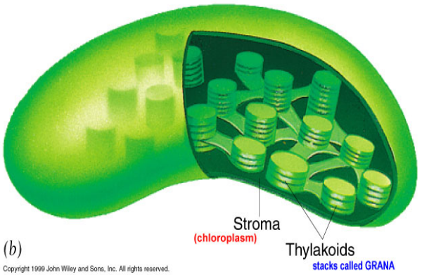

- This takes place in the **grana (stacks)** of the chloroplast
- It involves the very fast **movement** of **electrons** and **is not controlled by enzymes**
- Light is absorbed by a range of pigment clusters found in the chloroplast (almost all colours of light are absorbed but **green is normally reflected**)
- This light energy is transferred to the electron that has been passed to the chlorophyll
- This chlorophyll is in the pigment cluster and is strategically placed near an electron acceptor
- The pigment cluster absorbs as much light energy as possible and passes it to the chlorophyll which passes it to the electron
- The energised electron is passed to the electron acceptor which can then send it on one of two pathways

<!--card-->

**There are two different pathways involved in Light Phase**

##### Electron Pathway 1

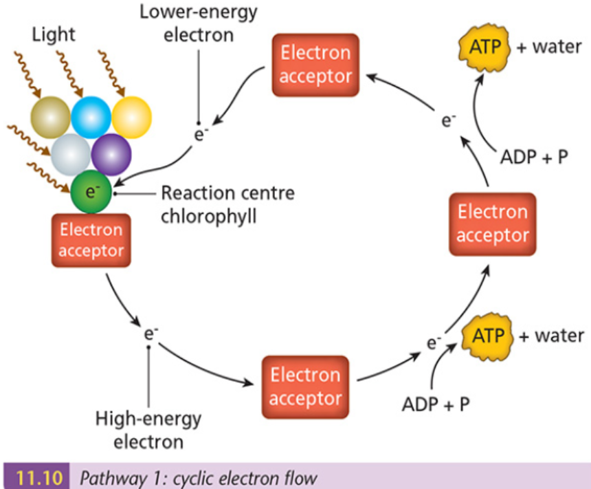

- ADP = Adenosine Diphosphate
  - 2 phosphates
  - Low Energy Carrier
- ATP = Adenosine Triphosphate
  - 3 phosphates
  - High Energy Carrier
  
- In pathway 1 the electrons pass from the first electron acceptor to a series of other electron acceptors and **back again to the chlorophyll**
- As the electrons are passed around they lose energy
- This energy is used to join a phosphate to ADP to form high energy ATP
- Water is also formed in this process
- **ADP + <u>Energy</u> + P -> ATP + Water**
- **The addition of phosphate to ADP is called <u>phosphorylation</u>**
- Because **the electron travel** in a cycle and returns to its **original chlorophyll** this process is called **<u>Cyclic Phosphorylation</u>**

<!--card-->

##### Electron Pathway 2

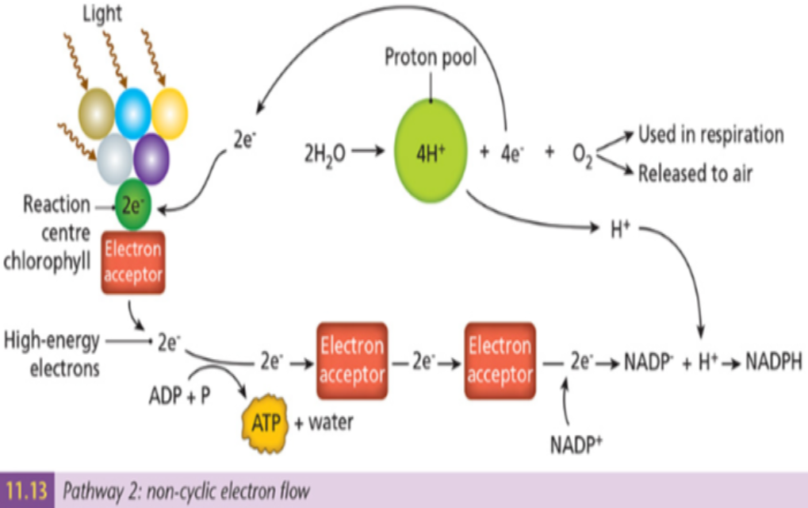

- 2 high energy electrons at a time are passed from chlorophyll to the electron acceptor and then along another series of electron acceptors
- In this case the electrons do not return to the original chlorophyll
- They lose energy as they pass from electron acceptor to electron acceptor and this energy is used to make more ATP
- Eventually the 2 electrons are passed to combine with NADP+ to form NADP-
- The chlorophyll molecule is now short of electrons and gains more from the splitting of water
- The splitting of water using light energy is called **Photolysis**
- The protons that were stored in the proton pool are attracted to NADP- and combine with it to form NADPH
- Because the electrons start at a chlorophyll and finish at NADPH and form ATP on their way this pathway is known as **Non cyclic photophosphorylation**

<!--card-->

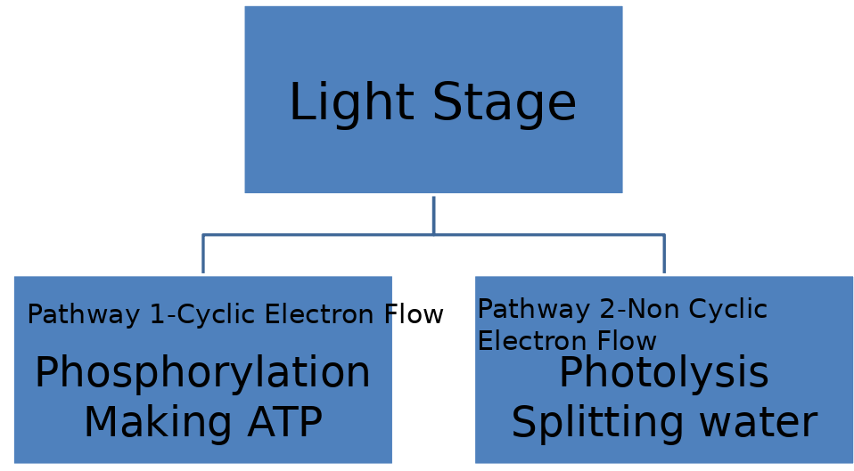

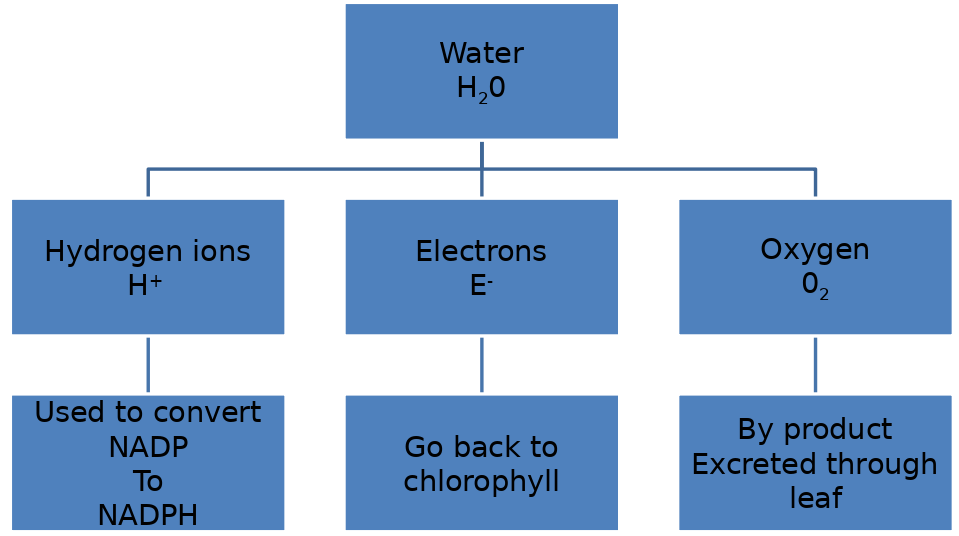

<!--card-->

##### End Products of the Light Stage

- There are 3 ends products of the light stage
1. ATP this will provide energy for the dark stage
2. NADPH this will provide protons + energised electrons for the dark stage
3. Oxygen is made when water is split

<!--card-->

#### Dark Stage (Light Independent)

- This may also be called the light independent stage as it can occur in the light but does not need to use it
- It takes place in the stroma of the chloroplast
- It is controlled by enzymes and therefore can be affected by temperature
- **Carbon dioxide from the air enters the chloroplast where they combine with protons + electrons to form glucose**
- This needs **energy** and protons + electrons
- It uses energy got from breaking down 
  - ATP into ADP + P
- It uses hydrogen ions and electrons got from breaking down 
  - **NADPH** into NADP+ + 2 electrons + H+
- Remember the addition of electrons to anything is known as reduction
- Carbon Dioxide is **reduced** to glucose

<!--card-->

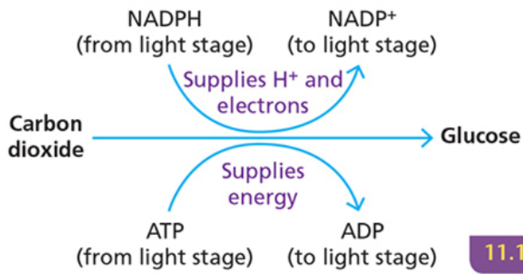

<!--card-->

## Main events in photosynthesis

- Light energy is absorbed by chlorophyll
- Water is split
- The electrons are passed to chlorophyll
- The protons are stored in the chloroplasts
- The oxygen is released
- Sunlight transfers energy to electrons
- The high energy electrons, stored protons (the hydrogen ions) and carbon dioxide are used to make glucose

<!--card-->

