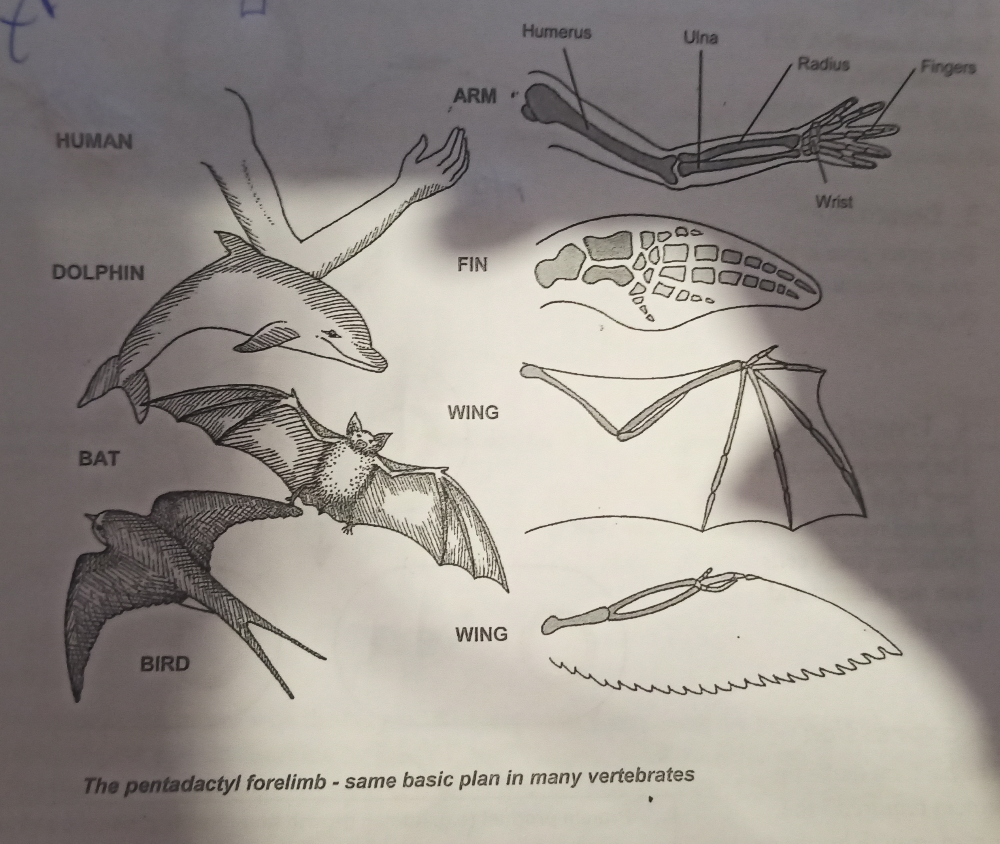
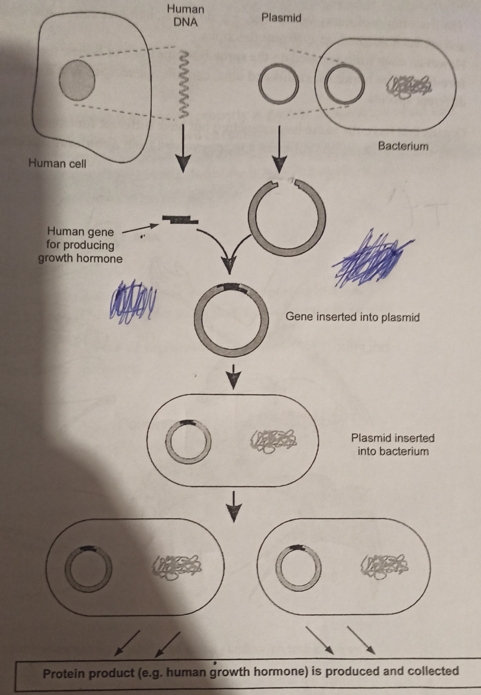

# Variation and Evolution

## Variation

Definition: **<u>Variation is differences between individuals of the same species</u>**

Variation in the population (even among family members) arises due to **Sexual Reproduction** and **Mutations**

<!--card-->

### 1. Variation and **Sexual Reproduction**

a. Sexual reproduction in diploid organisms must involve **meiosis** to produce the **haploid gametes**. **<u>Independent assortment</u> of the homologous chromosome pairs during meiosis ensures great <u>genetic variation</u> among the <u>gametes</u>**. (Punnett Square)

For example, human cells contain 23 pairs of chromosomes. *Either* **one** of each pair enters a gamete formation. Therefore a **gamete** could have the 'first' chromosome of one chromosome pair, and the 'second' chromosome of each of the other 22 chromosome pairs.

With 23 chromosome pairs, this means that there are about **8 million** possible combinations of chromosomes for each gamete formed.

b. **Random <u>fertilisation</u>** between the many **varied gametes (different eggs, different sperm) of two individuals leads** to huge genetic variation, ensuring that no two offspring will be genetically identical.

<!--card-->

### 2. Variation and **Mutations**

Definition: **<u>A mutation</u> is a change in the amount or structure of DNA**

**<u>Mutations</u> can arise anywhere, at random, on a chromosome**

This means that **any gene** can affected by a mutation

However, <u>cells can repair damage to DNA, so the number of mutations that survive is very low. If a gene is altered, it it likely that the change in its sequence of bases will mean that the correct protein is no longer formed</u>

**The new version of a gene formed in this way (by mutation) is called a recessive allele**

**Most mutations produce no change in the phenotype** (<u>physical appearance</u>) of the individual. This is because the dominant allele on the second homologous chromosome can still produce the original protein 

A very small number of mutations may be beneficial in that they accidentally produce an even better protein than the original one (see [Evolution](#evolution)<!--make go to evolution of this document-->). However, **most mutations are harmful**

Mutations in **somatic** (body) cells may not be harmful. This is because the gene that is altered may not be active in the particular body cell affected. A **<u>somatic mutation</u> is harmful if it causes an increase in the rate of mitosis as this could cause a tumour (cancer) to result**

**Mutations in a <u>gamete cell</u> (egg, sperm) are often very serious.** This is because **the mutation may be inherited by** the zygote and passed on to <u>all</u> the cells of the developing child

This can give to **<u>genetic defects</u> in the child and also in future generations**

<!--card-->

#### Causes of Mutations

**Changes in the <u>DNA structure</u> are caused by:**

i. **<u>Faulty DNA replication</u> making 'mistakes' in the base sequences**

ii. **<u>Mutagens</u>** (i.e. outside agents that cause mutations). Examples of **mutagens** are:
1. **Ionising radiation** such as **X-rays**, gamma rays and **ultraviolet (UV) radiation**
2. **Chemicals such as tobacco smoke (carcinogen -> cancer causing agent) and pesticides**

<!--card-->

#### <u>Types of Mutations</u>

##### <u>Gene Mutations</u>

**Gene mutations are changes to a <u>single gene</u>**

An example is **cystic fibrosis** which leads to the formation of **a thick mucus in the lungs and intestines.**

The recessive gene for cystic fibrosis (n) is present in 1 in 20 people - they are heterozygous carriers. 

When two carries have a child, there is a 1 in 4 chance that the child will inherit both recessive alleles (nn) and therefore have cystic fibrosis. Example: sickle cell anemia

##### <u>Chromosome Mutations</u>

If the pairs of chromosomes don't segregate (separate) properly at gamete formation, it could lead to the production of an egg or sperm which has, say, **two chromosome 21's.**

On fertilisation, the zygote would then end **up with three chromosome 21's instead of the usual two.** The extra **chromosome 21 cause** **<u>Down's Syndrome.</u>** Individuals with this syndrome have some degree of **learning difficulty and slower physical development**

<!--card-->

## Evolution

**Evolution is the gradual change, over a long period of time, in the characteristics of a species so that a new species is formed**

**A species is any group of organisms that can interbreed to produce fertile offspring**

<!--card-->

### Mechanism of Evolution

**Darwin** and **Wallace** (1858) proposed a theory to explain the mechanism by which evolution takes place.

This theory is called the **Theory of Natural Selection**, and is based on the following points:

1. Within a population there is **great variation** in genotype and phenotype
2. Population numbers remain constant. Therefore there is a **high death rate** among offspring
3. The high death rate is due to severe **competition for limited resources** - a struggle for survival exists
4. Individuals that are **genetically best adapted** to their environment will **survive**, i.e. they will be **selected** (survival of the fittest)
5. The best adapted survivors go on to **reproduce**
6. The **genes of the best adapted** are present in far greater proportion in the next generation
7. Populations become **better adapted** to their **environment** with each generation
8. If some members of the population move to a **different environment**, they will evolve, by Natural Selection, to **adapt** to the **new environment**
9. **Different 'qualities'** (i.e. those needed) will be selected in the new environment leading to differences, over time, between the 'moved' population and the 'original' population
10. When these genetic differences become so great that the two populations can **no longer interbreed to produce fertile offspring**, then a **new species** has been formed

<!--card-->

### One Source of Evidence for Evolution

#### Comparative Anatomy

Comparative anatomy is the study of **structural similarities** between species of the same broad grouping, e.g. vertebrates

The front limbs of many vertebrates, e.g. dolphins, humans, bats, birds, whales, etc., look very different and are each adapted for different functions.

However, each limb is based on the **same basic pattern** of bones, forming the **pentadactyl** (five-toed) **fore-limb**. The humerus, radius and ulna, carpals, metacarpals and five phalanges layout is present in each different species.

Organs that have the same basic structure but have different functions are called **homologous** structures.

They indicate that all the different species evolved from a **common ancestor** that had the **original plan**.

<!--card-->

# Genetic Engineering

**Genetic engineering is the process where humans artificially change the genetic make-up of an individual.**

It is now possible to take **genes** from one species and **insert them** into other species. 

For example, the gene that makes the **human growth hormone** can be extracted from **human DNA** and inserted into the **DNA** of a **bacterium**. The bacterium then divides and produces many copies of itself - each with the human gene for making the human growth hormone.

The bacteria then produce the growth hormone which can easily be collected.

<!--card-->

There are **5 stages** in the process of genetic engineering:

1. Isolation: Both human DNA and plasmid DNA are removed.
2. Cutting: Both human DNA and plasmid DNA are cut by the same enzyme.
3. Insertion: The target gene is placed into the plasmid DNA. (Ligation)
4. Transformation: The bacteria take in the 'new' plasmid. Bacteria reproduce producing many cells with the plasmid and target gene.
5. Expression: The bacteria make the protein required - the human growth hormone

<!--card-->

## 1. Isolation

Isolation means **removing** both the **human DNA** containing the **target gene** from its chromosome and the **plasmid DNA** from the bacterium. A plasmid is a loop of DNA found in a bacterium, in addition to its larger loop of DNA

<!--card-->

## 2. Cutting

Enzymes called **restriction enzymes** cut DNA at **specific** places. 

The human DNA and the plasmid DNA are cut with the <u>same</u> restriction enzyme. This ensures that the **'sticky ends'** of the human piece of DNA (containing the target gene) can **match by base-pairing** to the opened sticky ends of the plasmid DNA.

The **restriction enzyme** used cuts the **human DNA** at the base sequence **GAACGC** as shown below

 This cutting results in cut ends (sticky ends) with the base sequences TTGC and AACG as shown below

The **same restriction enzyme** is then used to cut the plasmid DNA. It cuts it when the same base sequence, **GAACGC**, appears. This leaves sticky ends which match (in a complementary way) with the human DNA

<!--card-->

## 3. Insertion

The cut plasmids are mixed with the human DNA segments (contains the target gene).

This allows the cut ends to **combine** by base pairing. The joining of the different DNA pieces is called **ligation**. **DNA ligase** (an enzyme) is used to join the two pieces of DNA together and form a strong bond between them.

<!--card-->

## 4. Transformation

Transformation is the **uptake of DNA into a cell**. When the bacteria and the **recombinant plasmids** are mixed, **some bacteria** take in the re-structured plasmid. These bacteria are **identified** and are **grown** on nutrient agar. Many bacteria with the human gene are produced.

The plasmid is called a **cloning vector** as it carries the foreign DNA into the bacterial host cell.

The bacteria cells then multiply, thereby cloning the human gene.

<!--card-->

## 5. Expression

**Expression** means getting the genetically engineered organism (the bacteria) to **produce** the required product (human growth hormone in this case). The product is then **isolated** and **purified**.

<!--card-->

## Applications of Genetic Engineering

### 1. Plants

Genes from bacteria can be added to the DNA of **crop plants** (e.g. wheat, barley). The crop plants are then **resistant** to certain **herbicides** (weed-killers). A herbicide will kill the weeds but will not affect the crop plants.

### 2. Animals

**Haemophiliacs** cannot produce a certain blood-clotting factor **(factor VIII)**. The human gene for producing factor VIII can be inserted into **sheep DNA**. The **transgenic sheep** then produce factor VIII in their milk. This can be harvested and given to **haemophiliacs** to treat their condition.

#### 3. Micro-organisms

The human gene for producing **human growth hormone** can be inserted into bacteria **plasmids**, so that the bacteria can then produce human growth hormone *(as described in this Chapter)*.
