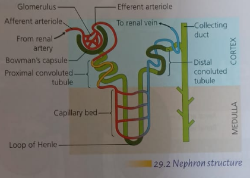
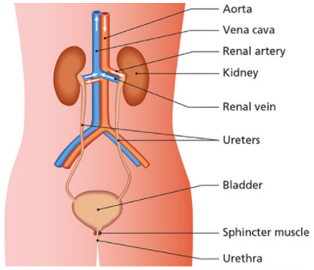
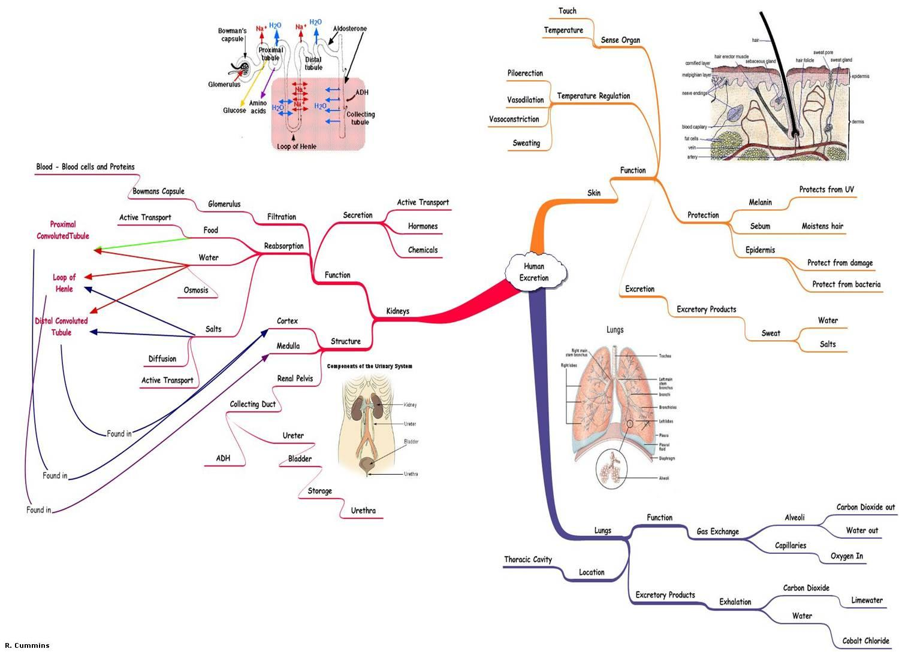
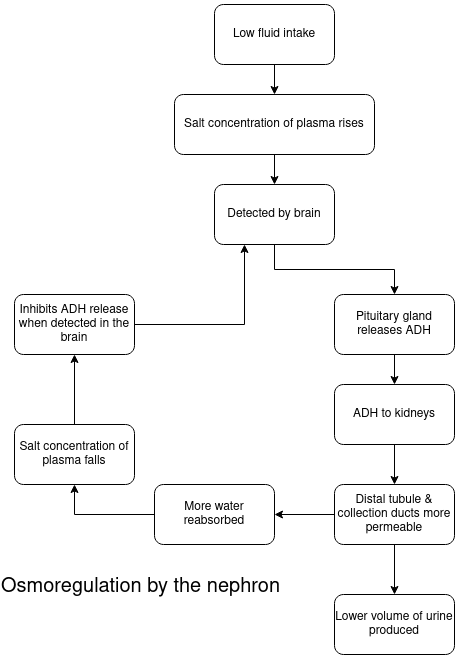

# Excretion
The removal of waste products from the body

<u><b>Homestasis</b> is the maintenance of a stable internal environment in an organism</u>

- <u><b>Ectotherms</b></u> are animals that obtain <u>their heat</u> from <u>external sources</u>
- <u><b>Endotherms</b> generate their heat with their own body reactions</u>

The main excretory organs are:
1. lungs (water and carbon dioxide)
2. skin (water and salts)
3. kidneys (water, salts, and urea)

## Kidney

### The functions of the kidneys are
1. <u>excretion of water, salts, and urea</u>
2. <u>osmoregulation:</u>
    - <u>control the water content of the blood</u>
    - <u>control the salt concentration of the blood</u>
3. <u>control the pH of the blood (and body fluids)​</u>

### The kidneys make urine in the following way
- blood <u>(containing waste (urea, uric acid, excess salt and water))</u> enters the kidneys through the renal arteries
- <u>the kidneys filter waste and useful materials from the blood</u>
- <u>useful materials are reabsorbed from the kidneys back into the blood</u>
- some materials are secreted from the blood into the kidneys
- <u>urine formed in the kidneys flows to the bladder</u> through the ureters
- <u>blood (low in waste) leaves the kidneys in the renal veins</u>
- <u><b>The bladder</b> stores urine</u>
- <u><b>Urine is excreted</b> through the urethra</u>

## Nephrons
- carry out the functions of the kidneys
- are located in the cortex and medulla of the kidney
### A **nephron makes urine** as follows

**Filtration:**
- blood enters the nephron in the afferent arteriole
- this forms many capillaries called the glomerulus
- high pressure in the glomerulus forces water and small molecules out of the blood
- glomerular filtrate is a dilute solution of waste and useful molecules

**Reabsorption takes**  place in the following parts of the nephron:
- **proximal tubule** = water by [osmosis](movement-of-molecules-across-cell-membranes.md#2-osmosis), useful molecules and most salts by [diffusion](movement-of-molecules-across-cell-membranes.md#1-diffusion) and [active transport](movement-of-molecules-across-cell-membranes.md#3-active-transport)
- **loop of Henle**
    1. descending limb = water by [osmosis](movement-of-molecules-across-cell-membranes.md#2-osmosis)​
    2. ascending limb = salts by [diffusion](movement-of-molecules-across-cell-membranes.md#1-diffusion) and then by [active transport](movement-of-molecules-across-cell-membranes.md#3-active-transport)​
- **distal tubule** = water by [osmosis](movement-of-molecules-across-cell-membranes.md#2-osmosis) and some salts by [active transport](movement-of-molecules-across-cell-membranes.md#3-active-transport)
- **collecting ducts** = water by [osmosis](movement-of-molecules-across-cell-membranes.md#2-osmosis)

---

## ADH and the Control of Water Loss (OSmoregulation) by the Nephron

ADH = Anti-diuretic Hormone

The **permeability** of the **collecting duct wall** to **water** is controlled by the hormone **ADH** (anti-diuretic hormone) made in the **pituitary gland** in the brain

If a lot of **salt** has been consumed or a lot of **water** has been **lost** by the body (eg. in sweat), the blood becomes too **concentrated** and water needs to be added to it

**Osmoreceptors** in the **hypothalamus** of the brain are stimulated and a message is sent to the pituitary to release **more ADH** into the blood

This causes the **walls** of the **collecting duct** to become **more permeable** to water and so **more water** leaves the collecting duct and goes into the blood. The urine remaining now has a **smaller** volume and is **more** concentrated

Drinking a lot of water results in less ADH being released, the walls remaining impermeable to water and therefore water remaining in the collecting duct. A **watery** urine of **greater volume** results

