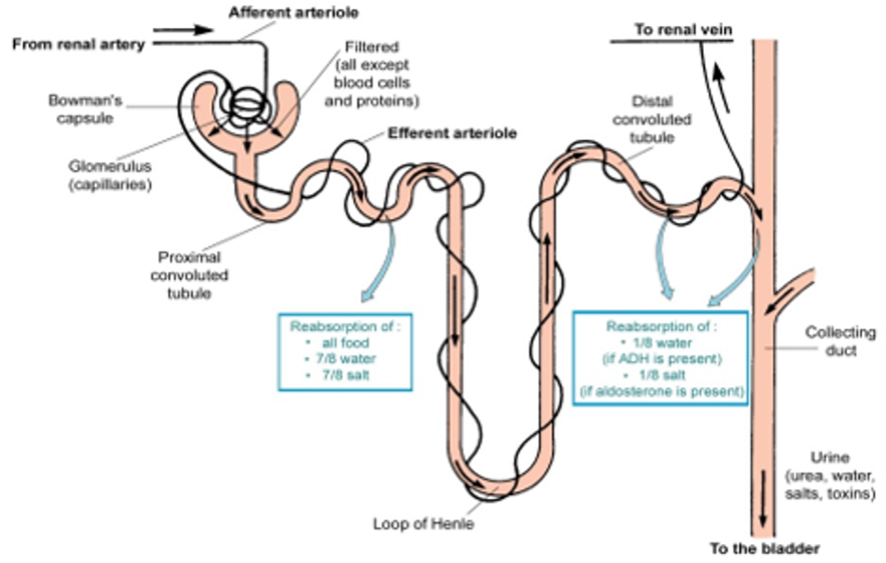

# Excretion
The removal of waste products from the body

<u>**Homestasis** is the maintenance of a stable internal environment in an organism</u>

- <u>**Ectotherms**</u> are animals that obtain <u>their heat</u> from <u>external sources</u>
- <u>**Endotherms** generate their heat with their own body reactions</u>

The main excretory organs are:
1. lungs (water and carbon dioxide)
2. skin (water and salts)
3. kidneys (water, salts, and urea)

## Kidney

### The functions of the kidneys are
1. <u>excretion of water, salts, and urea</u>
2. <u>osmoregulation:</u>
    - <u>control the water content of the blood</u>
    - <u>control the salt concentration of the blood</u>
3. <u>control the pH of the blood (and body fluids)​</u>

### The kidneys make urine in the following way
- blood <u>(containing waste (urea, uric acid, excess salt and water))</u> enters the kidneys through the renal arteries
- <u>the kidneys filter waste and useful materials from the blood</u>
- <u>useful materials are reabsorbed from the kidneys back into the blood</u>
- some materials are secreted from the blood into the kidneys
- <u>urine formed in the kidneys flows to the bladder</u> through the ureters
- <u>blood (low in waste) leaves the kidneys in the renal veins</u>
- <u>**The bladder** stores urine</u>
- <u>**Urine is excreted** through the urethra</u>

## Nephrons
- carry out the functions of the kidneys
- are located in the cortex and medulla of the kidney
### A **nephron makes urine** as follows
- **Filtration:**
- blood enters the nephron in the afferent arteriole
- this forms many capillaries called the glomerulus
- high pressure in the glomerulus forces water and small molecules out of the blood
- glomerular filtrate is a dilute solution of waste and useful molecules

**Reabsorption takes**  place in the following parts of the nephron:
- **proximal tubule** = water by osmosis, useful molecules and most salts by diffusion and active transport
- **loop of Henle**
    1. descending limb = water by osmosis​
    2. ascending limb = salts by diffusion and then by active transport​
- **distal tubule** = water by osmosis and some salts by active transport
- **collecting ducts** = water by osmosis

---

Active Transport - Movement of a substance across a semi-permeable membrane against a concentration gradient (high concentrations to low)

Osmosis - Movement of water across a selectively permeable membrane from an area of high concentration to an area of low concentrations

Diffusion - Movement of molecules from an area of of high concentration to an area of low concentration example: perfume (no membrane required)

<!--Change above to link to pages/sections in pages-->