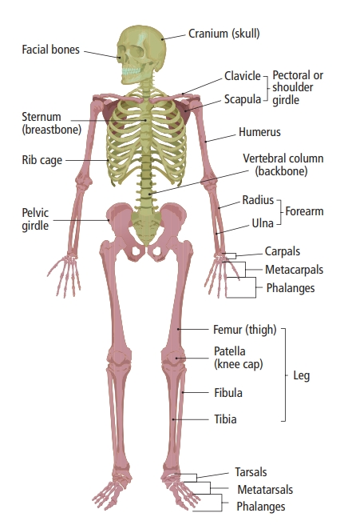
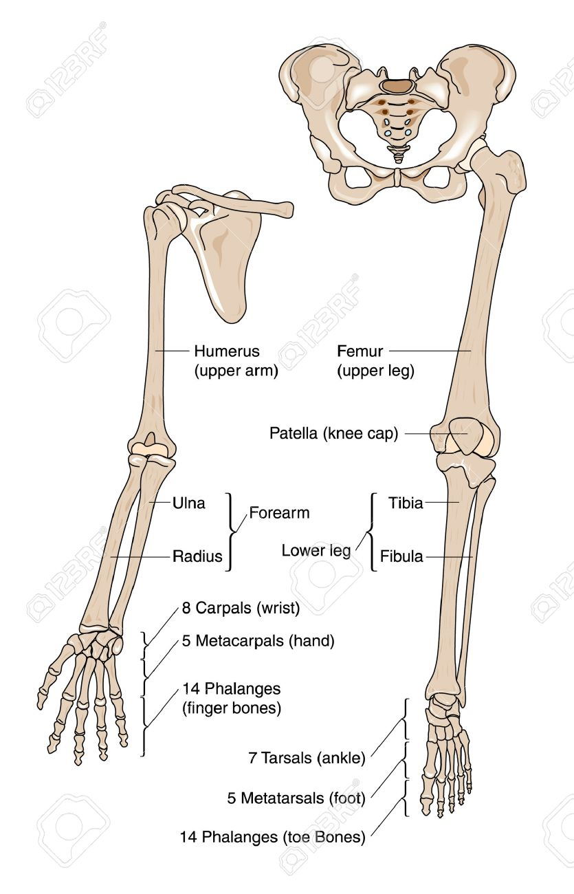
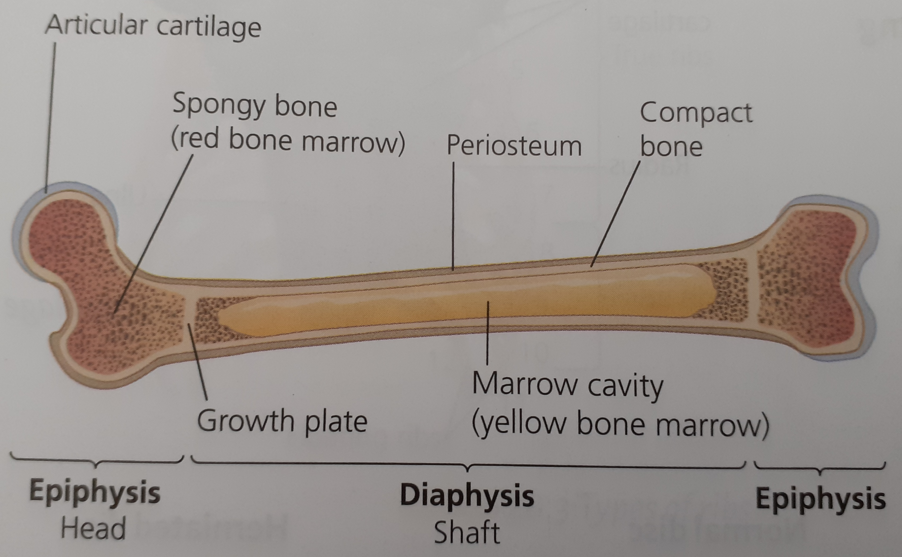
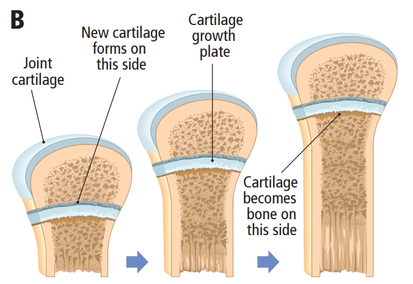
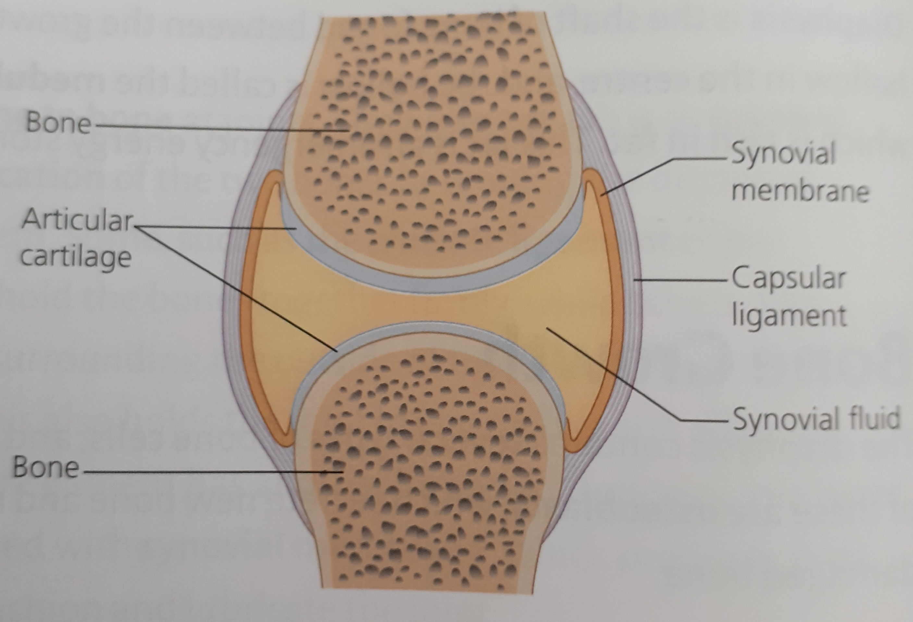
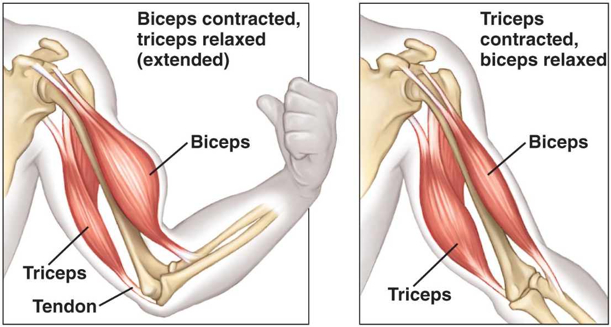
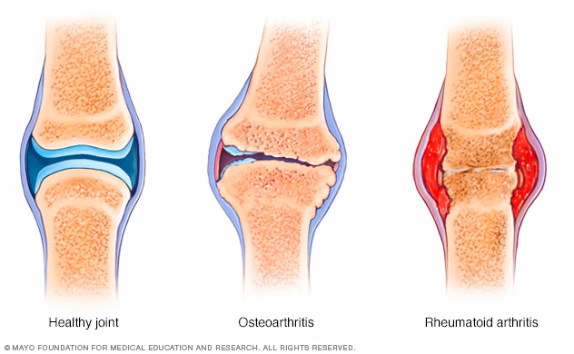

# Skeletal System

## Syllabus Objective

- Description of the structure and functions of the skeleton
- Component parts of the axial skeleton: skull, vertebrae, ribs, and sternum
- Position and function of discs in relation to vertebrae
- Component parts of the appendicular skeleton: pectoral and pelvic girdles and their attached limbs
- Macroscopic anatomy of a long bone: medullary cavity, compact bone, spongy bone, and cartilage
- Function of the following: cartilage, compact bone, spongy bone (include red and yellow marrows)
- Classification, location and function of joints: immovable, slightly movable, free-moving or synovial
- Role of cartilage and ligaments in joints
- Role of tendons
- General relation of muscles to the skeleton – antagonistic muscle pairs as exemplified by one human pair
- Disorders of the musculoskeletal system: one example of a musculoskeletal disorder, from the following: arthritis and osteoporosis; one possible cause, prevention, and treatment
- Osteoblast role in bone growth. Terminating development of adult height. Role of osteoblasts in bone cell replacement. Bone renewal. Role of calcium in bone

## Description of the structure and functions of the skeleton

The skeleton contains 206 bones and can be divided into an axial and appendicular skeleton. It provides support, protection and allows movement

**Functions of the Skeleton**

1. Support
    
    The skeleton provides an internal framework that provides space for organs to develop
    
2. Protection (of major organs)
    
    The skull protects the brain, the rib cage protects the lungs and heart but can move in and out to allow breathing.The vertebrae protect the spinal cord which runs through it
    
3. Movement
    
    When muscles attached to bones contract they cause movement
    
4. Blood Cells
    
    Blood cells are made in the bone marrow of the ribs, pelvis and sternum
    
    
    
## Component parts of the axial skeleton: skull, vertebrae, ribs, and sternum. Position and function of discs in relation to vertebrae

The axial skeleton consists of the skull, vertebrae, ribs and sternum

The back consists of 33 vertebrae bones

- *7 cervical vertebrae are in the neck
- *12 thoracic vertebrae in the upper back attached to each of 12 pairs of ribs.
- 5 lumbar vertebrae in the lower back
- 5 fused sacral vertebra
- 3 small vertebrae in the coccyx

Discs of cartilage are found in between the vertebrae and act as shock absorbers

## Component parts of the appendicular skeleton: pectoral and pelvic girdles and their attached limbs

The **appendicular skeleton** consists of the pelvic girdle (hips), the pectoral girdle (shoulders), the scapula, clavicle (collar bone) and the bones of the arms and legs

**Arms Bones**

Humerus, radius, ulna, carpals, metacarpals, and phalanges

**Leg Bones**

Femur, tibia, fibula, tarsals, metatarsals, and phalanges

## Macroscopic anatomy of a long bone: medullary cavity, compact bone, spongy bone, and cartilage.
Function of the following: cartilage, compact bone, spongy bone (include red and yellow marrows

Bone is mixture of organic material -protein and inorganic material calcium phosphate.
The periosteum is a thin layer of connective tissue that covers the outer surface of bone.

**Compact bone** found in the shaft of long bones is dense with very few gaps provides support and protection

**Spongy bone** found in the heads of long bones is low density with spaces often filled with bone marrow

**Medullary cavity**

Bone marrow is found in the medullary cavity of long bones. Yellow bone marrow acts as a store of fat, red bone marrow produces blood cells

**Cartilage** at the ends of long bones act as shock absorbers and reduce friction at joints

## Osteoblast role in bone growth. Terminating development of adult height. Role of osteoblasts in bone cell replacement. Bone renewal. Role of calcium in bone

Bone is constantly broken down and replaced by cells called Osteocytes which remove calcium removing excess bone and osteoblasts lay calcium down building bone

Continued renewal of bones depends on calcium in the diet, exercise and is affected by parathormone levels in the blood

During growth osteoblasts produce a layer of bone around the cartilage growth plate between the diaphyses and epiphyses. The growth plates allows the bones to elongate during childhood and puberty and eventually calcify and turn completely to bone at the end of puberty

## Osteocytes and osteoblasts

- Osteocytes are cells that dissolve bones
- Osteoblasts are cells that form new bones

## Classification, location and function of joints: immovable, slightly movable, free-moving or synovial. Role of cartilage and ligaments in joints. Role of tendons

A joint is where 2 bones meet

**Immovable Joints**

The skull consists of a number of bone plates fused together

**Slightly movable Joints**

Vertebrae can move a little providing limited flexibility

**Free-moving Joints**

The elbow and knee are examples of hinge joints; the hip and shoulder are ball and socket joints. Synovial fluid lubricates the joint. **Cartilage** act as shock absorbers and prevents bones rubbing against each other causing pain

**Tendons** attach bone to muscle

**Ligaments** attach bone to bone

**Synovial membrane makes synovial fluid**

- Hinge joints move in one plane only
    - Example: elbow
- Ball & Socket Joints can move in all planes
    - Example: shoulder

## General relation of muscles to the skeleton – antagonistic muscle pairs as exemplified by one human pair

Muscle is contractile tissue that has the ability to shorten and generate a pulling force

Skeletal muscles are voluntary muscles as they can be consciously controlled

Antagonistic muscles work opposite each other in pairs 

Example: the biceps and triceps

The biceps contracts and the triceps relax to raise the lower arm

The triceps contracts and the biceps relax to lower the lower arm

As one contracts the other must relax

### Biceps and Triceps, Raising and Lowering

| Muscles | Raising  | Lowering  |
|---------|----------|-----------|
| Biceps  | Contract | Relaxs    |
| Triceps | Relaxs   | Contracts |

## Disorders of the musculoskeletal system: one example of a musculoskeletal disorder, from the following: arthritis and osteoporosis; one possible cause, prevention, and treatment

**Arthritis**

Arthritis is inflammation or swelling that affects the joints and can limit movement of the joint and cause pain

**Cause**

It can be caused by wear and tear of the joint during manual work or can be caused if the white blood cells of the body attack the cartilage of the joint

**Prevention**

Maintaining a healthy weight may limit the effects of arthritis. No known preventative measure yet

**Treatment**

It can be treated with anti-inflammatory painkillers and artificial joint replacement

The main difference between **osteoarthritis and rheumatoid arthritis** is the cause behind the joint symptoms. **Osteoarthritis** is caused by mechanical wear **and** tear on joints. **Rheumatoid arthritis** is an autoimmune disease in which the body's own immune system attacks the body's joints

## Section Recap Videos

[Playlist of Skeleton Videos](https://youtube.com/playlist?list=PLgPhtu6xzA1fuQOvvfCotuRBqrem5qB5t)