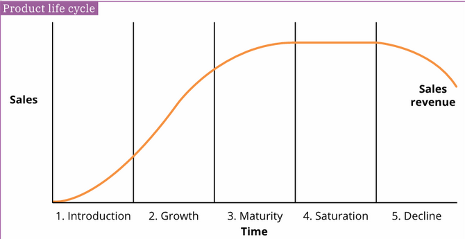

# 17. The Marketing Mix

## Learning Outcomes from this chapter

**On completion, you should be able to**

- Outline the marketing mix for a product of your choice
- Illustrate the benefits of branding for a business and the consumer
- Explain what is meant by ‘own brand’ and give examples
- Discuss the factors that a business considers when designing a product
- Outline the functions of packaging
- Illustrate the product life cycle for a good/service and explain how it can be extended
- Explain the factors a business considers when setting a selling price
- Distinguish between the different pricing strategies a business could use
- Describe the different promotion techniques a business can use to sell a good/service
- Outline the functions of advertising
- Describe the role of public relations and methods used to develop good PR
- Evaluate the different sales promotions techniques a business could use
- Outline the benefits and challenges of using different channels of distribution
- Explain the impact of ICT on promotional techniques
- Explain the impact of changing consumer needs on the marketing mix

## The Marketing Mix

[The Marketing Mix](17%20The%20Mar%201ed43/The%20Market%20c2dbd.csv)

## Product

[Product](17%20The%20Mar%201ed43/Product%20481ba.csv)

### Product Life Cycle

[Product Life Cycle](17%20The%20Mar%201ed43/Product%20Li%2059f8b.csv)

[Extending the product life cycle (4 P’s)](17%20The%20Mar%201ed43/Extending%20%205c0b2.csv)

### Branding

#### Branding (From Teacher)

- USP is main focus of branding
- Images, text, logos, phrases, shape, packaging, etc.
- Makes product interesting
- Customer loyalty
- Good brand can charge higher prices
- Easier to go global
- USP is main focus of branding

#### Benefits of Branding for a Company

- Helps to differentiate the product from rivals
    - A brand gives a product a clear identity that can make it instantly recognisable. This helps a business, as consumers are more likely to buy a brand if they know and trust it
        - A consumer shopping for a block of butter will probably recognise the Kerrygold brand, so may be more likely to buy it over other competitors like Glenstal butter.
- Opportunity to promote the brand, not just a product
    - A business that has developed a strong brand can choose to just promote the brand itself and not advertise each of its products. This marketing tool will help reduce costs. Advertising one of its products with the brand name might remind consumers of other products that the business sells too
        - McDonald’s launched an advert showing groups of people on the way to a wedding all stopping at its restaurants en route. This promoted all of the options the company sells, not just one restaurant or one meal
- Consumer Loyalty
    - A consumer might stay loyal to a brand over a long period of time. A business could release new products in its range aimed at different age groups to target this
        - A consumer who grew up eating Kellogg’s Rice Krispies might choose Kellogg’s All Bran or Corn Flakes. Kellogg’s also offers Special K, giving consumers who might have eaten other Kellogg’s products a lower-calorie option

#### Benefits of Branding for a Consumer

- Gives confidence and peace of mind
    - When a consumer chooses a recognised brand, they might pay more for it, but feel more confidence in the brand. The consumer might think it is safer to choose a well-known brand when buying an expensive item or a new type of good they have not used before
        - A consumer might be happier to pay more for an Apple iPhone than a Sony mobile phone, as they know Apple is a popular brand in that market, so they would not worry as much about their decision to spend a lot of money
- Helps to judge a product
    - Brands help consumers to judge the expected quality or performance of different options. They can use branding to judge how long a product might last or if it is value for money. The country in which a brand is produced could also influence the consumer
        - Parma ham from Italy might be seen as superior to other hams, or French perfume superior to that of other countries
- Makes it easier to choose
    - A consumer is faced with so many decisions in a grocery or retail store. Easily recognisable logos and packaging can make decisions more straightforward, as certain brands are associated with a positive value, characteristic or position
        - If a consumer sees an Adidas logo on a pair of leggings, they know they are good quality

#### Own-brand (From Teacher)

- Offers cheaper alternative
- Bigger profit share for the company e.g. Dunnes
- Lead to repeat customers
- Easily recognisable product
- Speciality goods

## Price (different pricing strategies)

[Price (different pricing strategies)](17%20The%20Mar%201ed43/Price%20(dif%206a7b1.csv)

[Factors that influence price](17%20The%20Mar%201ed43/Factors%20th%20befcb.csv)

## Promotion

[Promotion](17%20The%20Mar%201ed43/Promotion%205e515.csv)

[Types of advertising](17%20The%20Mar%201ed43/Types%20of%20a%20145c1.csv)

[Promotion (impact of ICT)](17%20The%20Mar%201ed43/Promotion%20%2016722.csv)

## Place

[Channels of distribution](17%20The%20Mar%201ed43/Channels%20o%2074db6.csv)

[Factors for choosing a channel of distribution](17%20The%20Mar%201ed43/Factors%20fo%202440d.csv)