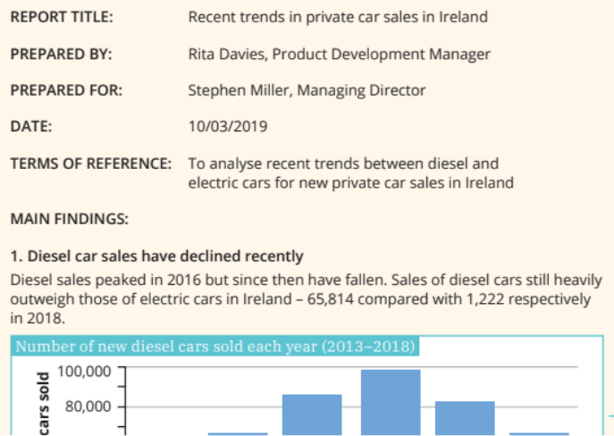

# 7. Management Skills: Communicating

## Learning Outcomes from this chapter

- Explain the central role of communications in business and management
- Distinguish between the methods of communication
- Discuss the importance of general communication skills
- Identify and explain the main barriers to effective communications
- Demonstrate business data in written forms, including business letters, reports and memos
- Draft a visual presentation from data
- Identify the duties of a chairperson and secretary, and draft an agenda and minutes of a meeting
- Illustrate the impact on business due to changes in ICT
- Understand what ‘GDPR’ is and the role of the Data Protection Commission in data protection in Ireland

## Communication

**Communication** is the transferring of information from the sender to the receiver through a medium

**Internal communication**

This is the transfer of information between staff in a workplace

**External communication**

This the transfer of information from the business to its stakeholders.Stakeholders include: investors, suppliers, interest groups, customers, government and society

### Elements that help make communication effective

|Term              |Definition                                                |
|------------------|----------------------------------------------------------|
|The Right Duration|No overload                                               |
|Accurate Message  |Clear and structured with expected outcomes               |
|Language          |Appropriate terms/jargon to ensure message is understood  |
|Visual Aids       |Clear charts, graphs and summaries                        |
|Confidentiality   |Ensure any sensitive information is secure                |
|Feedback          |Allow/encourage feedback                                  |
|Timing            |Instant interaction for urgency                           |
|A Record          |Easily retrievable messages containing data, details, etc.|

### How effective communications can help a business

- Improved employee morale
- Improved accuracy
- Better decisions
- Quicker decision-making
- Lower staff turnover

#### Removing barriers to effective communication with stakeholders

|Term              |Definition                                                |
|------------------|----------------------------------------------------------|
|Noise             |Choose a quiet setting                                    |
|Lack of Clarity   |Ensure the message is clear; use professionals            |
|Lack of Accuracy  |Upskill staff                                             |
|Language          |Adapt the language to suit the recipient                  |
|Timing            |Use face-to-face for urgency                              |
|Wrong Medium      |Host confidential meetings where necessary                |
|Information Overload|Give clear and concise instructions                       |
|Technology        |Invest to upgrade systems and apps                        |

## Elements of a business letter

- Letterhead (company name, address, contact)
- Reference (customer no./order no.)
- Date: Use today’s date, if asked
- Subject (Re:)
- Introduction
- Main body
- Conclusion
    - Salutation: ‘Yours sincerely’ (if you know their name) OR ‘Yours faithfully’ (if you don’t know their name)

## Important elements of a report

- Report title
- Prepared by
- Prepared for
- Date
- Terms of reference
- Main findings
- Recommendation/conclusion
- Signature/job title

## What a memo looks like and what is needed

In the 2009 exam, 6 out of 10 marks were for layout of the memo

### Types of Business Meetings

|Term              |Definition                                                |
|------------------|----------------------------------------------------------|
|Annual General Meeting (AGM)|Mandatory yearly gathering of shareholders                |
|Extraordinary General Meeting (EGM)|Urgent gathering of shareholders to vote                  |
|Board meeting     |Monthly meeting of board of directors                     |
|Ad hoc meeting    |Unplanned meeting for issues that arise suddenly          |
|General meeting   |Regular meetings (e.g. staff meetings)                    |

## Duties of the secretary and chairperson

### Secretary

- Sends notice and agenda to all who should attend
- Arranges venue, facilities, ICT, etc.
- Deals with correspondence
- Records the minutes and types them up after the meeting
- Aids the chairperson in the smooth running of the meeting

### Chairperson

- Sets the agenda for the meeting
- Ensures a quorum (minimum no. of attendees needed to start)
- Reads/adopts minutes of previous meeting
- Manages the meeting (timing, fair speaking time for all attendees)
- Calls for votes and has the casting vote in the event of a tie

## Notice and agenda for a meeting

Notice - Sent out to everyone due to attend a meeting; outlines what the meeting is, who it is for, where it will be, and when it will start/end

Agenda - **Business meeting:** Review of previous meeting’s minutes, chairperson’s report, auditor’s report, declaration of dividends, election of directors, and any other business (AOB) 
**Club meeting:** Review of previous meeting’s minutes, chairperson report, secretary’s report, treasurer’s update, sub fees for next year, elections, and any other business (AOB)

### The developments of ICT and its impact on business

|Term              |Definition                                                |
|------------------|----------------------------------------------------------|
|Cloud Storage     |Internet security needed                                  |
|E-commerce        |Over-reliance on internet                                 |
|Networking        |Resources into non-sales                                  |
|Videoconferencing |Saves time and travel costs                               |
|Cyber crime       |Hackers/disruption                                        |
|Regulations       |GDPR compliance costs                                     |
|Apps/Websites     |Investment required                                       |
|CAD               |Harder to control spread of designs                       |

### General Data Protection Regulation (GDPR)

|Term              |Definition                                                |
|------------------|----------------------------------------------------------|
|Business Responsibilities|Use for specified purpose, keep data secure, obtain fairly, provide copy|
|Individual rights |Copy in 30 days, can have data erased/corrected, can obtain info on processing|
|Data Protection Commission (DPC)|National independent body to uphold personal data rights  |
|Implications of GDPR|Higher standards, transparency, data breach fines, compensation|
