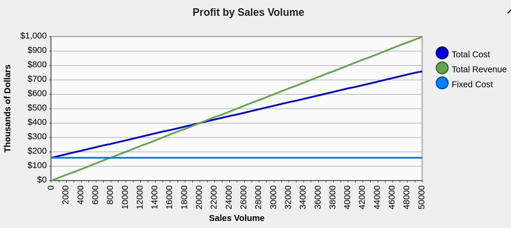
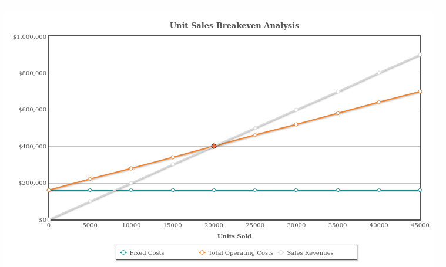
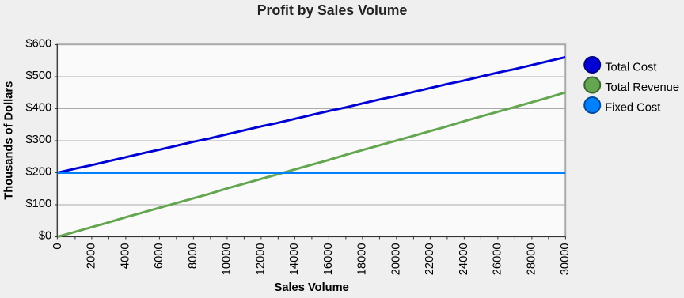
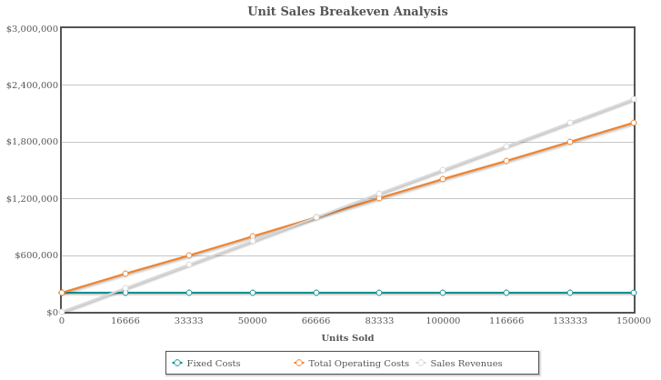

# Break-Even Analysis Example

X axis = Units/Product Numbers

Y axis = Money

---

Forecast Output = 50,000

Fixed Costs = €160,000

Selling Price = €20

Variable Cost = €12

---

Selling Price - Variable Cost = Contribution

20 - 12 = 8

Contribution = €8

---

20 x 5,000 = 100,000

12 x 5,000 = 60,000 + 160,000 = 220,000

---

---

Break-even point (BEP) = €400,000

20,000

BEP is the point where Total Revenue and Total Cost meets

---

### Margin of Safety

1. 50,000 x €20 = €1,000,000
2. 50,000 x €12 = €600,000 + €160,000 = €760,000
3. €1,000,000 - €760,000 = €240,000

---

### Extra Graph

---

# Second Break-Even Analysis Example

Forecast Output = 30,000

Fixed Costs = €160,000

Selling Price = €15

Variable Cost = €12

---

15 - 12 = €3

---

## Total Costs = F.C. + V.C.

| V.C.                  | F.C.       | T.C.      |
|-----------------------|------------|-----------|
| 12 x 5,000 = 60,000   | \+ 200,000 | = 260,000 |
| 12 x 10,000 = 120,000 | \+ 200,000 | = 320,000 |
| 12 x 15,000 = 180,000 | \+ 200,000 | = 380,000 |
| 12 x 20,000 = 240,000 | \+ 200,000 | = 440,000 |
| 12 x 25,000 = 300,000 | \+ 200,000 | = 500,000 |
| 12 x 30,000 = 360,000 | \+ 200,000 | = 560,000 |

---

15 x 5,000 = 75,000

15 x 10,000 = 150,000

15 x 15,000 = 225,000

15 x 20,000 = 300,000

15 x 25,000 = 375,000

15 x 30,000 = 450,000

---

B.E.P = N/A 

Margin of Safety = N/A

Profit = €0

---

---

### Extra Graph

