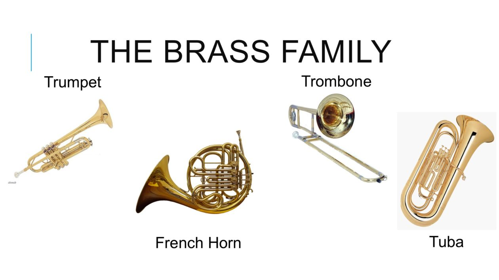
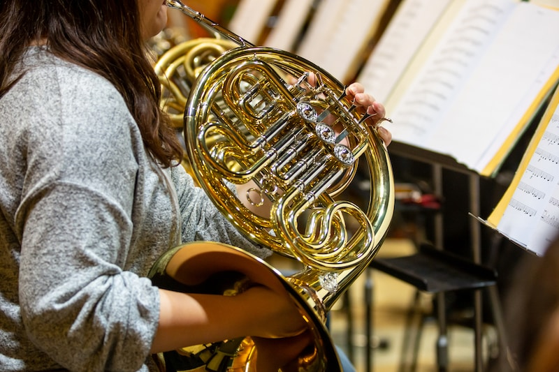
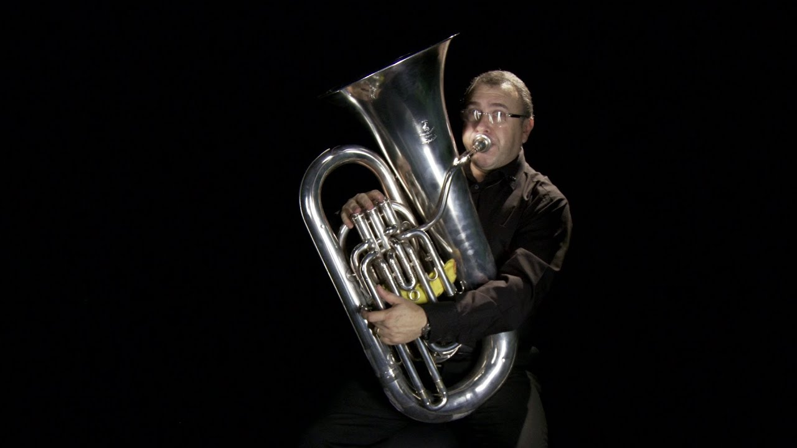
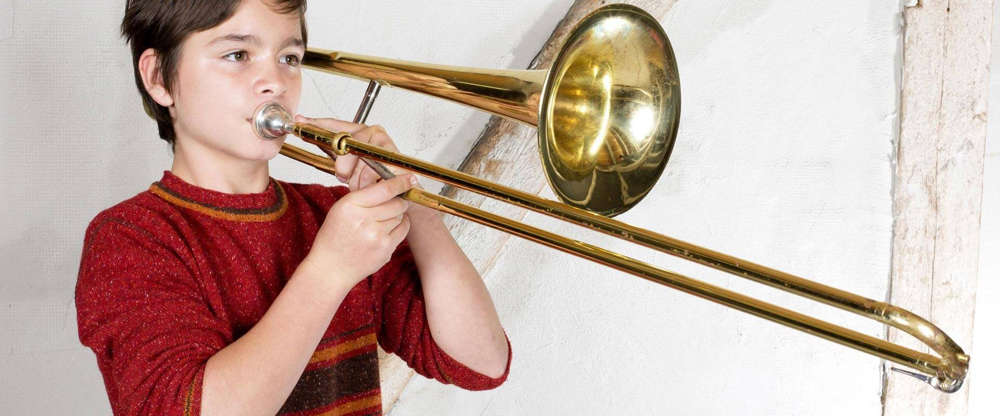

# Brass Family

All instrument are made from brass

The brass instruments can play louder than any other instruments in the orchestra and can be heard from far away

Consist of very long pipes that widen at the end forming a bell like shape

Like woodwind players, brass players use their breath to produce sound. Instead of blowing into a reed, brass players vibrate their lips bu buzzing them against a metal cup-shaped mouthpiece

Most brass players have valves which are like buttons. When the players presses down on the valves, they open and close different parts of the pipes

To change pitch and sound, players press different valves and buzz their lips harder and softer

Instruments of the brass family:

- (French) Horn
- Trumpet
- Trombone
- Tuba

## Trumpet

- Plays the highest notes in the orchestral brass section

[https://youtu.be/B1eyZAedhY4](https://youtu.be/B1eyZAedhY4)

## French Horn

- Lower range than trumpet and trombone but higher than the tuba

[https://youtu.be/dbsJRiDnxyo](https://youtu.be/dbsJRiDnxyo)

[https://youtu.be/_MkMdlfl8Hg](https://youtu.be/_MkMdlfl8Hg)

## Tuba

- Biggest off all the brass instruments
- Usually plays bass but it is capable of playing higher notes

[https://youtu.be/YtDgMqQ6n8U](https://youtu.be/YtDgMqQ6n8U)

## Trombone

- Only one in the orchestral brass family which has no valves
- Use slide mechanism
- Pushing the slide out produces the lower sound
- Pulling slide in produces higher sound

[https://youtu.be/UewOoFyeXMo](https://youtu.be/UewOoFyeXMo)
