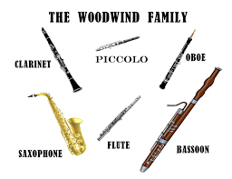
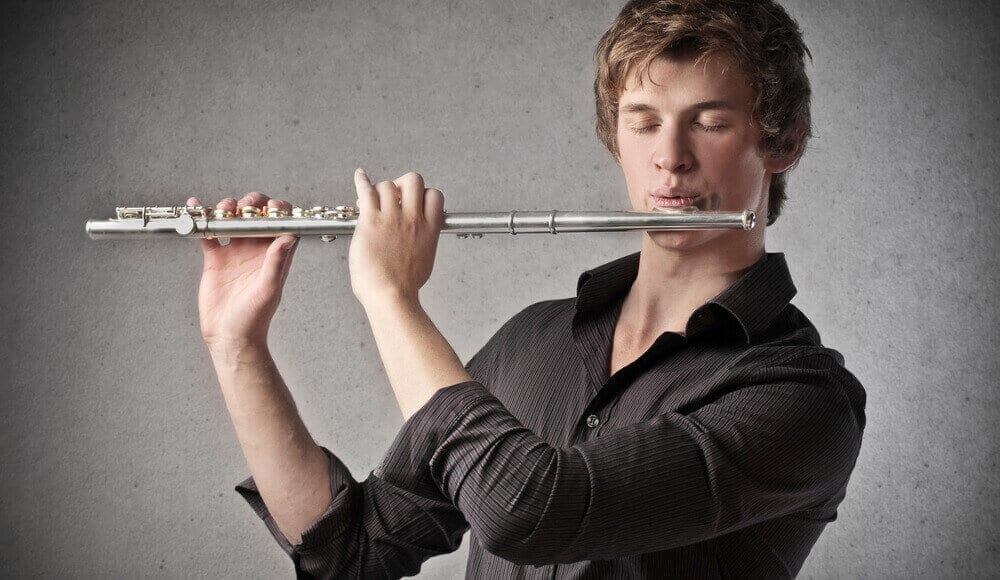
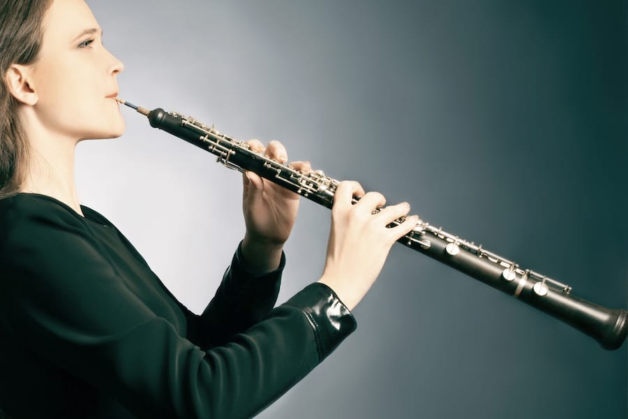
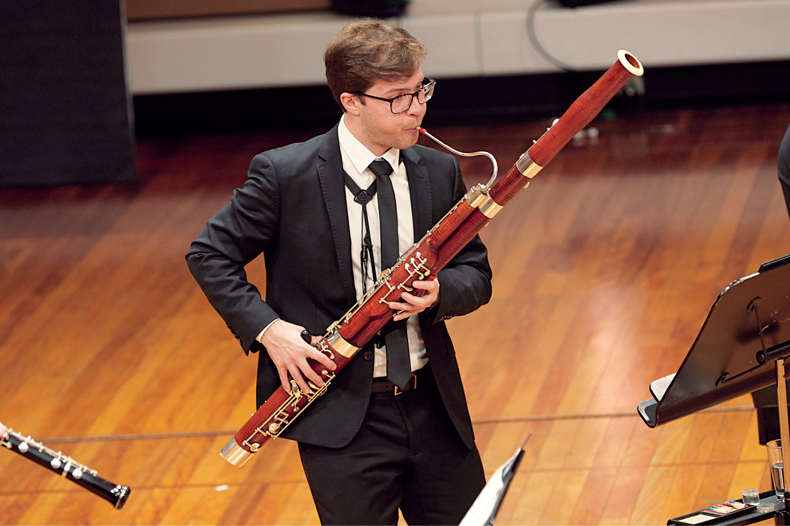

# Woodwind Family

The wind section of the orchestra is traditionally known as the woodwind section even though not all the instruments are made of wood

Situated behind the string family in the orchestra

There are two main types of woodwind instruments which are flutes and reed instruments:

### Flutes

Flutes produce sound by directing a focused stream of air below the edge of a hole in a cylinder shaped tube. Flutes can be divided into two sub-types, open flutes and closed flutes

### Reeds

Reeds produce sound by focusing air into a mouthpiece which then causes a reed or reeds to vibrate. Reed instruments can be split into two sub-types, single reed and double reed

---

Instruments of the woodwind family:

- Flute
- Piccolo
- Clarinet
- Oboe
- Bassoon
- Saxophone

## Flute

- Sounds very bright and cheerful playing high notes
- Orchestras will have of least two

[https://youtu.be/k2I9WPnWfdM](https://youtu.be/k2I9WPnWfdM)

## Piccolo

- The piccolo is a small flute that plays on octave higher than the ordinary flute
- Highest sounding instrument in the orchestra, often referred to as a bird call

[https://youtu.be/JPMtpeq0eLg](https://youtu.be/JPMtpeq0eLg)

## Clarinet

- The clarinet is a single reed instrument
- There are various types of clarinets with each one representing a different pitch

[https://youtu.be/iYwPJrRnGSE](https://youtu.be/iYwPJrRnGSE)

## Oboe

- Double reeded instrument
- Fast passages can be played

[https://www.youtube.com/watch?v=jnlKsPG-WX0](https://www.youtube.com/watch?v=jnlKsPG-WX0)

[https://www.youtube.com/watch?v=2WJhax7Jmxs](https://www.youtube.com/watch?v=2WJhax7Jmxs)

## Bassoon

- Double reeded instruments
- Plays bass lines
- Fast passages using double tonguing

[https://www.youtube.com/watch?v=xidC7TZRxkA](https://www.youtube.com/watch?v=xidC7TZRxkA)

## Saxophone

- Made of brass but uses a reed to produce sound therefore it is classed as a woodwind instrument
- Various types of saxophones varying in pitch from high to low
- Not a typical orchestral instrument but used as soloist instrument

[https://www.youtube.com/watch?v=179BXpkmLrY](https://www.youtube.com/watch?v=179BXpkmLrY)
