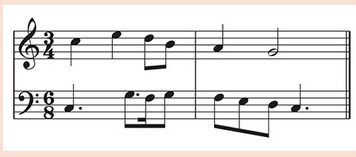
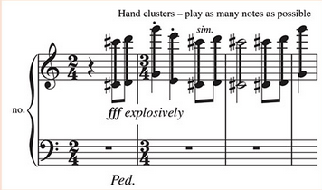
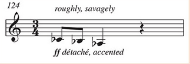

# Piano Quartet No. 1 by Gerald Barry

## Compositional Techniques

- Canon = Created when a melody is imitated by one or more parts at a fixed distance + interval contains 2, 3, 4, 5, part canons. When parts overlap in this way polyphony is created. In Sections: A, B2, E1, C5, C6, C7, C9, H
  - 
- Inversion = Flipping the melody upside down, inverting its melodic shape. If a melody opens on a descending scale, it's inversion will open with an ascending scale. In Section: A
  - 
- Retrograde = A retrograde results from the rewriting and performing of an original melodic line in reverse. In this quartet, Barry has created the thematic material for E1 by using the retrograde of D1. In Sections: E1, F + C8
  - 
- Wedging = Stretching the melodic intervals of the original melody
  - 
- Splicing = Reducing the interval distance between notes of original melody
  - 
- Polymetry = Combining two different time signatures simultaneously
  - 
- Counterpoint = Combining two or more different melodies simultaneously
  - 
- Telescoping = Taking first and final fragments from the piece to create new material

## Instrumental Techniques

- 8ve/8va = Instructions on the score to play on octave higher or lower
  - 
- Hammered = Play with force
  - 
- Clusters = Playing a group of adjacent notes simultaneously on piano. Creates dissonant sound
  - 
- Detaché - Using a separate movement of bow for each note
  - 
- Open Strings - When string not stopped by placing finger on fingerboard
  - 
- Double Stopping = Playing two notes at the same time
  - 
- Harmonics = Overtones that create whistling sound
  - 
- Flautando = Playing bow across strings on fingerboard instead of body
  - 
- Senza Vibrato = No vibrate
  - 

## Feature of 20th Century Music

- 1901 - 2000
- No dominant + style resulting in the genre being hard to define
- Tonality - use of dissonance
- Texture - polyphonic is common
- No structure/plan -> inspiration comes from the heart

## Introduction

- The Piano Quartet was first performed in London in 1992
- Example of 20th Century contemporary quartet for 4 instruments (Piano, Violin, Viola, Cello)
- Popular form of chamber music in the Baroque + classical eras
- Takes inspirations from Irish trad melodies and 
  - Sí Bheag Sí Mhór
  - Tis the Last Rose of Summer
  - Beidh Aonach Amórach
  - Lord Mayo is Delight
- These melodies are used in many different ways to help Barry's own style and interpretation of the music
- Melodies become unrecognisable
- Pushes boundaries of compositions such as <u>no local centre</u> (not major or minor)
  - no recognised form (structure)
  - use of new instrumental and compositional techniques

## The main function of the piano:

- Creates contrasting textures with strings
- Double string parts - very often
- Plays one or more voices in <u>canon</u>
- Introduces dissonance
- Plays note cluster
- Solo section - "Hommage Á horowitz"

## Instruments Techniques

- Open strings
- Hand clusters on piano
- Harmonics - delicate whispey sound
- Détaché - detached - Separate bow for each note
- Flautando - Bow over the fingerboard

## Form

- Quartet begins and ends with music that is heard only once
- Section C is centre of piece occur occuring 9 times but never the same
- One movement - 18 sections
- Eight themes (4 appear once)
- A, B1, C1, C2, B2, C3, D1, D2+B3, E1, C4, C5, E2+D3, C6, C7, F
- Unusual form - doesn't fit a standard one
- Ends with 3 new sections (F, G, H) - unusual

## Tonality

- Mainly Atonal
- Section A is pentatonic (no 7th notes)
- B+B1 refer to key of C
- C1 is in A flat
- E2+D3 only section with noted key signature (B flat minor)

## Rhythmic Features

- Over 330 time signature changes
- Unusual time signatures 1/8
- Complex rhythmic patterns
- Irregular rhythms + patterns
- Metronome marks for tempo changes
- Polymetry - Combining different metres simultaneously

## Compositional Features

- Canon
- Retrograde -> Melody played backwards (E1 is retrograde of D2)
- Augmentation -> Note values are lengthened, usually doubled (C8)
- Diminuation -> Note values are shortened (B1 notes are halved in B3)
- Wedging -> Making intervals bigger (C2+C3)
- Splicing -> Making intervals smaller (C2+C3)
- Inversion -> Melody turned upside down
- Counterpoint -> Combining 2 themes - polyphonic (D2+B3)
- Telescoping -> Fragments of previous sections in a short section (Section G)

## Section A

### Layout

- Based on inversion of "Sí Bheag Sí Mhór"
- 4 part canon at distance of a crotchet, yet all being at same time
- Feeling of C major
- Mainly 3/4 but time signature changes

### Contemporary Features

- Harmonies
- Open strings
- Canon at distance of crotchet
- Time Signature changes

### Non-Contemporary Features

- Instruments
- Use of canons
- Repetition
- Range
- Staccato
- 2 Bass Clefs

## Section A1

- Starts to develop
- Loud dynamics
- Very high register and wide range
- Piano entirely in Bass Clef
- Five part canon
- Harmonics - open strings
- Very polyphonic
- Two part piano
- Page repeated, louder 2nd time

## Section B1

- Key C major
- Atonal
- Homophonic
- Rhythmic melody on violin, starts with upbeat in 3/4
- Drone like staccato two note pattern on viola
- Slower speed
- Change of time signature to 5/8 creating instability and imbalance
- Cello part is inversion of viola two note patterns
- From bar 90, melody is repeated on all 3 string instruments playing an octave apart
- Melody repeated without accompaniment

## Section B2

- B section melody is played 5 times in canon creating polyphonic texture, varied slightly each time
- Very loud
- Viola, violin, cello

### Bars 188 - 205

- Three part canon on strings
- Piano doubles string parts at the octave in bass clef

### Bar 222

- Three part canon in 5ths at octave on strings + piano
- Violin, viola, cello, piano
- Double stopping on violin
- Soft dynamics and light articulation

### Bar 239

- Repeat of canon from previous part
- Drone affect using adjacent open strings
- Pedal note on D in strings
- Double stopping on strings

## Section D2+B3

- Both sections heard simultaneously
- D2 on violin and RH (right hand) piano. B3 on viola and cello in unison 
- B melody in diminuation
- LH (left hand) piano plays hurdy-gurdy in 3rds
- B3 becomes rhythmically distorted adding tension
- Music is repeated at bar 344 with different time signatures
- Texture -> polyphonic

## Section C1

- Takes music from *Tis the Last Rose of Summer*
- Strings only
- Polyphonic
- 2 melodies on violin + viola
- Feeling of A flat
- Flow of melodies interrupts by abrupt time signature changes
- Harmonies on cellos

### From Bar 124

- Repeated on octave lower
- Piano introduced
- Louder + faster

## Section C2

- Based on C1
- Atonal
- Violin and viola melodies
- Polyphonic
- Slower
- Softer dynamics
- Wedging and splicing
- No piano

## Section C3
- Based on 4 different versions
- Gets louder and faster each time
- Polyphonic

### Bar 256

- Viola and cello repeat C2 with descant melody on violin
- Violin doubles cello part at intervals of 2nd and 7th (dissonance)
- Slow
- Quieter
- No piano

### Bar 272

- Single fragmented piano line, doubles some strings parts at interval of 2nd
- Faster and louder than previous
- Double stopping

### Bar 288

- Higher pitch - cello in treble clef
- Faster and louder

### Bar 303

- Violin higher

## Section C4

- Hommage á Horowitz
- Piano solo - only instrument with solo section
- Very very loud
- Derived from C melodies
- Both hands play in octaves
- [x] Homophonic
- Flamboyant
- Dedicated to Horowitz, a Russian pianist

## Section C5

- Shortened version of C3
- Slower
- 3 part canon distance of a crotchet
- Soft dynamics
- Changing time signatures
- No piano
- Canon repeated at bar 415 with some notes left out

## Section C6

- 3 part canon at distance of a quaver
- C6 is C5 up a semi-tone and shortened
- Instruments technique *flautando* used - Played on finger board giving a wispy sound
- Polyphonic
- Soft dynamics

## Section C7

- Based on C material but sounds like a new section
- Cello based on one of original C melodies
- Piano doubles string parts
- Notes added at distance of 2nds, 4ths and 5ths - adds dissonance
- Polyphonic

### Bar 483

- Faster
- Double stopping adds to intensity
- Higher pitch, accelerates then stops suddenly

## Section C8 + F

- One bar rest, then new material, F, on violin
- Triplets in Melody, jig rhythm, Irish dance music
- Piano part is retrograde of F melody
- C material heard in augmentation (longer notes) on viola and cello
- Polyphonic
- Different time signatures used simultaneously - polymetry (need to know)

## Section C9

- One bar rest then 3 part canon two octaves are crotchet distance
- Shortest and slowest section of C
- Polyphonic
- Wide distance between parts, high pitch in violin, low pitch in cello

## Section D1

- Based on Beidh Aonach Amárach
- Shortest section of D
- A minor
- Shortest time sig in piece used 1/8
- Loud
- Homophonic
- Hurdy gurdy effect in cello
- Very unstable due to time signature changes
- 3/16 time signature
- Repeated notes in melody on viola

## Section D2+B3

- See previous section with the heading "Section D2+B3"

## Section D3+E2

- Only section with a noted key signature - B flat minor
- E and D combined and up a semitone to B flat minor
- Polyphonic
- Very loud, with accented notes
- E2 is a retrograde of D and heard on violin and viola in unison
- D3 heard on cello on piano RH in unison
- Music repeated at bar 442 with violin an octave higher and piano LH octave lower

## Section E1

_ 4 part canon at distance of quaver at the octave, violin, viola, cello, LH piano
- D2 played in reverse (retrograde)
- Repeat sign
- Changing time signatures - obscure
- Polyphonic
- Loud with accented notes

## Section E2+D3

- See previous section with the heading "Section E2+D3"

## Section F+C8

- See previous section with the heading "Section F+C8"

## Section G

- New music but derived from rest of quartet
- Telescoping - complete work in nine bars by taking notes from beginning an end of each section
- Homophonic
- Very fast
- Very loud with accented notes
- Constantly changing time signatures

## Section H

- Based on Irish tune, "Lord Mayo's Delight"
- Polyphonic
- 2 part canon, unison, distance of crotchet on viola, cello
- Flautando used again

### Bar 542

- 3 part canon, unison, distance of crotchet, viola, cello and Piano LH - base on second part of tune

### Bar 558

- Final section return to first part of tune
- 3 part canon, unison, distance of crotchet, violin, viola, cello
- Soft dynamics
